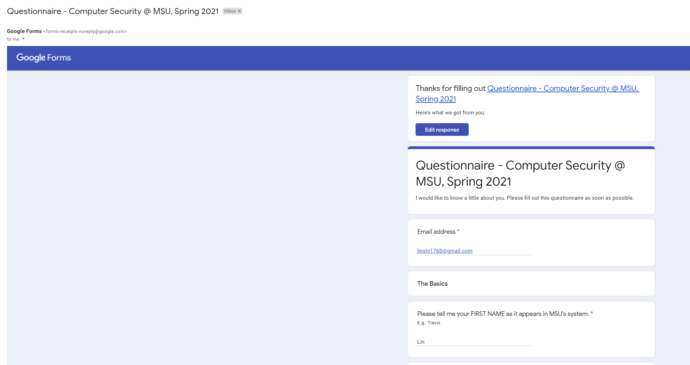
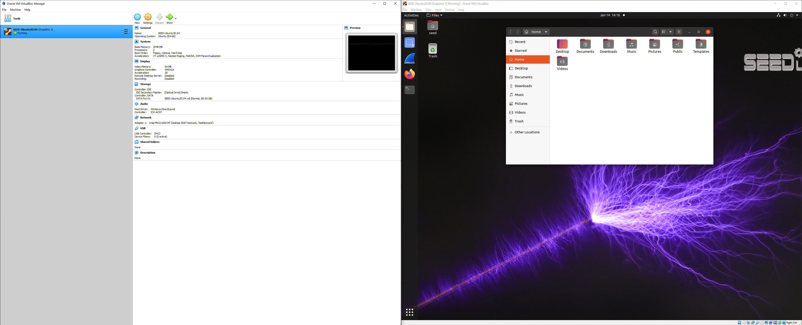

### Name: Lin Shi (n92s773)
### Course: CSCI 476
### Email: linshi1768@gmail.com

#### lab00
#### January 19, 2021

1. 
2. 
3. Through lab zero, I have learned and remembered some ideas about VirtualBox, markdown, and GitHub.   
First, VMs depend on the GPU for its performance; thus, if the VM is slow at responding, the GPU assigned to the VM must be increased. (This was done after a solid time of waiting).  
Second, in order to properly run a VirtualBox, one must go into the BIOS while restarting the computer and enable the Virtualization Technology (This might not be the exact name of it).   
Third, if the GitHub version is too low, it will fail to authenticate and cause some weird errors. Therefore, I have learned to update Git Bash, which could be done with git update-git-for-windows. 
Lastly, I have learned how to insert images into GitHub READMEs, which is easier than I expected.
