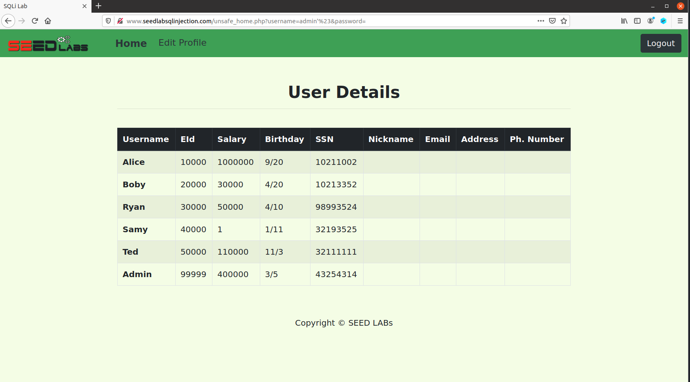

## Lab04 SQL Injection Attack Lab
###### Lin Shi (n92s773)
###### linshi1768@gmail.com
###### CSCI 476
###### March 9, 2021
<br>


**Note: Since the url included what I typed in as username and password, I did not include any screenshots of my login page.**

Before the tasks, I set up the environment by getting the container up:
```
[03/09/21]seed@VM:~/.../lab04$ docker-compose build
...
[03/09/21]seed@VM:~/.../lab04$ docker-compose up -d
...
```


### Task 1:
In this task, I am trying to get familiar with the SQL statements by running code in the container:
```
[03/09/21]seed@VM:~/.../lab04$ docker-compose up -d
Creating network "net-10.9.0.0" with the default driver
Creating www-10.9.0.5   ... done
Creating mysql-10.9.0.6 ... done
[03/09/21]seed@VM:~/.../lab04$ dockps
a5b28e4aa195  mysql-10.9.0.6
b6a9424b1293  www-10.9.0.5
[03/09/21]seed@VM:~/.../lab04$ docksh a5
root@a5b28e4aa195:/# mysql --user=root --password=dees
mysql: [Warning] Using a password on the command line interface can be insecure.
...

mysql> show databases
    -> ;
+--------------------+
| Database           |
+--------------------+
| information_schema |
| mysql              |
| performance_schema |
| sqllab_users       |
| sys                |
+--------------------+
5 rows in set (0.02 sec)

mysql> use sqllab_users;
...

Database changed
mysql> show tables;
+------------------------+
| Tables_in_sqllab_users |
+------------------------+
| credential             |
+------------------------+
1 row in set (0.00 sec)

mysql> SELECT * FROM credential WHERE Name='Alice';
+----+-------+-------+--------+-------+----------+-------------+---------+-------+----------+------------------------------------------+
| ID | Name  | EID   | Salary | birth | SSN      | PhoneNumber | Address | Email | NickName | Password                                 |
+----+-------+-------+--------+-------+----------+-------------+---------+-------+----------+------------------------------------------+
|  1 | Alice | 10000 |  20000 | 9/20  | 10211002 |             |         |       |          | fdbe918bdae83000aa54747fc95fe0470fff4976 |
+----+-------+-------+--------+-------+----------+-------------+---------+-------+----------+------------------------------------------+
1 row in set (0.01 sec)

mysql>

```
First, I looked up the container id of the MySQL container. Then I navigate to the container with **docksh** command. Once I am in the container, I logged in with the root username and password. Then with the **show databases** command I can see all the databases we have. Next, I **use** the sqllab_users to navigate to look at the sqllab_users. Then I use **show tables** to look at the tables that have been set up in sqllab_users. Then with SQL command **SELECT * FROM credential WHERE Name='Alice';**, I can see all the information for Alice. The first task is just to get familiar with the SQL statements, for the [full input](Task1.txt).

### Task 2:

#### Task 2.1:
For this task, we are trying to log in as admin without knowing his/her password:

For this task, I looked at the SQL code and realized that the name is within single quotes and I also know that # is used for comments in SQL. Thus, I included **admin'#**. The SQL statement will think that it ended with the single quote and the rest of the code, where it asked for the correct password will be commented out. Therefore, as long as there exist a name of admin, we could log in.

#### Task 2.2:
For this task, we are trying to log in as admin by command line and not use the interactive login page provided to us:
```
[03/09/21]seed@VM:~/.../lab04$ curl http://www.seedlabsqlinjection.com/unsafe_home.php?username=admin%27%23&password=
```
I will use something very similar to before. Additionally, I used to URL Encoded Characters cheatsheet provided to us to determine the proper notation for single quote and #, which are **%27** and **%23**. Then I received a long html page, which I rendered and took a screen shot of the rendered page.

As we can see, I have logged in as admin again. This time through the command line. The overall approach is just as Task 2.1; however, we included the proper notation for single quote and #. For full [html page](Task2-2.html).

#### Task 2.3:
For this task, we are trying to do two SQL statement at once:
```
admin'; UPDATE credential SET nickname='Lin', WHERE name='admin'#
```
I used the same start followed by ; and the second SQL statement that I want to execute.

This time, I saw that it will flag the error for my second SQL statement. Since there is a countermeasure that prevents adding a UPDATE or DELETE statement to our original SQL statement, it makes perfect sense that it will flag our second statement.

### Task 3:

#### Task 3.1:
In this task, we are trying to modify a field that we should not have the ability to, salary. First, I logged in as Alice and use the Edit Profile tag on the top. Then I included the following line in NickName:
```
', salary=1000000 WHERE name='Alice'#
```


When it updated Alice's profile, I found that:

Alice's salary has been successfully changed to 1 million. When looking at the code, I could see that it was following the same format as above. Therefore, if I included the end single quote and comma followed by the field that I would like to modify. I was able to change Alice's salary. Additionally, I found **', salary='1000000** will work just fine. This time, we are not ignoring everything else; instead, we are closing the nickname field and adding the salary field. In both approaches, we are just ending the nickname field and adding another field of salary, whether or not we choose to ignore everything else is totally optional since we are just modifying Alice's profile. Thus, as long as the format is fine, it will work.

#### Task 3.2:
This time, we are trying to modify the salary field of Samy. Therefore, I included the following input to nickname:
```
', salary=1 WHERE name='Samy'#
```


When I login as admin to look at everyone's salary, I found:

Samy's salary is 1. Similar to our approach in Task 3.1, we are ending the nickname field and appending a salary field. However, this time, we must end with **WHERE name='Samy'#**. Since we are modifying another person's profile, we must change the default WHERE clause. Thus by adding a new WHERE clause followed by #, it will take the new clause and everything else after # will be ignored. Therefore, we have modified Samy's salary.

#### Task 3.3:
For this task, we are trying to change the Samy's password, we use the SHA1 hash provided to us to find the hashed value of the new password, abc. Then we include the following code in nickname:
```
', password='a9993e364706816aba3e25717850c26c9cd0d89d' WHERE name='Samy'#
```


Then we can login with as Samy with password abc:

As we can see, I have logged into Samy's account using the password abc. Overall, our approach is very similar to above. Where we would close off the nickname field, append our password field and add what we want for the values, then close it off with a WHERE clause. Overall, I was able to change Samy's password in Alice's profile and log in as Samy.


### Task 4:
For this task, we are trying to get a safer SQL through a prepared statement. First, I went to /defense and tested to make sure the vulnerability still exist by using the username **admin'#**:


Then I went to the file and modified the php code to use prepared statement:
```
$stmt = $conn->prepare("SELECT id, name, eid, salary, ssn
                        FROM credential
                        WHERE name= ? and password= ?");
$stmt->bind_param("ss", $input_uname, $hashed_pwd);
$stmt->execute();
$stmt->bind_result($id, $name, $eid, $salary, $ssn);
$stmt->fetch();
```
First, similar to the example given to us, I changed **query into prepare**. Then I replaced spots where the data should be included with **?**. Then similar to the example, I bind the parameters, input_uname and hashed_pwd, with **bind_param**. However, since our data are both strings, it will be **ss** apposed to is. Next, I ask it to **execute**. Then the **bind_result** will add all the SELECTs we wish to accomplish, which are id, name, eid, salary, and ssn. Finally, I ask the program to **fetch** the information. Above are the portion that I modified. For the full php [code](unsafe.php).

Then I shut down and rebuild my container:
```
[03/09/21]seed@VM:~/.../lab04$ docker-compose down
...
[03/09/21]seed@VM:~/.../lab04$ docker-compose build
...
[03/09/21]seed@VM:~/.../lab04$ docker-compose up -d
Creating network "net-10.9.0.0" with the default driver
Creating www-10.9.0.5   ... done
Creating mysql-10.9.0.6 ... done
```
For the full output of the [rebuild process](Task4.txt). Then I tried the same tactic using **admin'#** and I did not receive any output from the database.


To verify that I did not just break the program, I tried logging in normally as admin and I was successful.

Overall, I understood how prepared statement helped define the boundaries of code and data more clearly. We would include all the necessary code and leave the data as **?**. Then we would inject the appropriate data into their spots. Which is a great countermeasure against the SQL injection attack.
