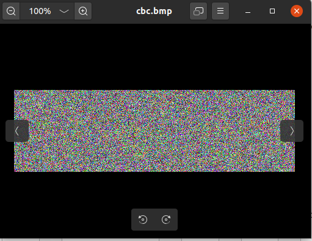
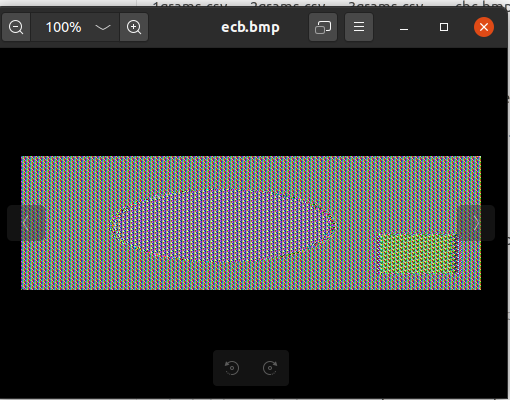
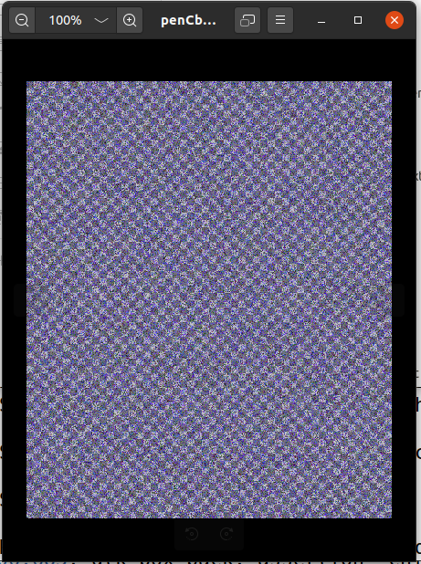
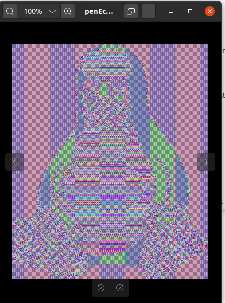
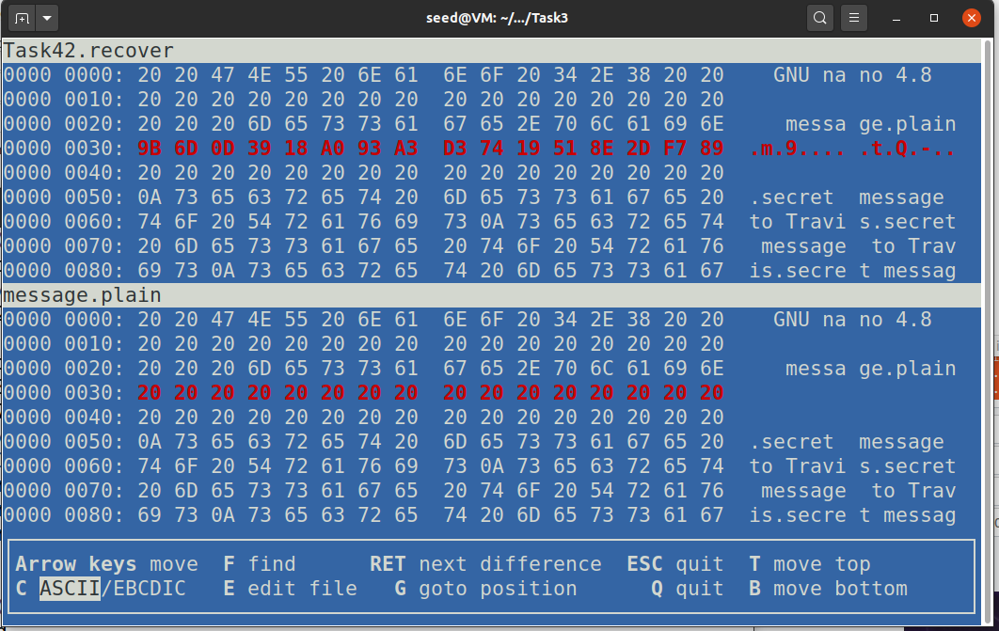
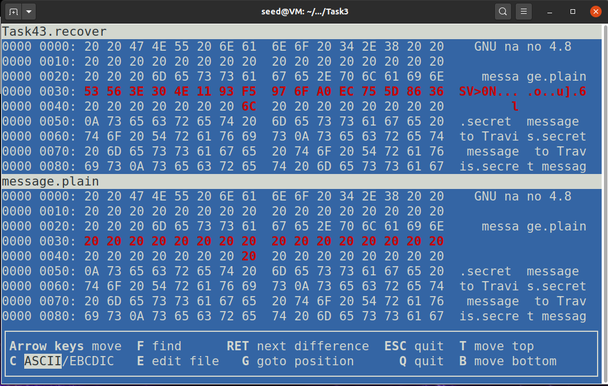
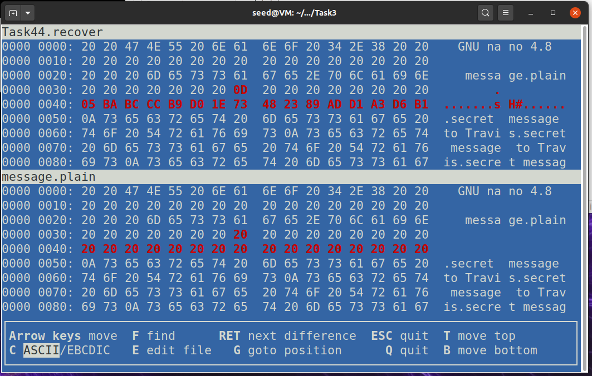
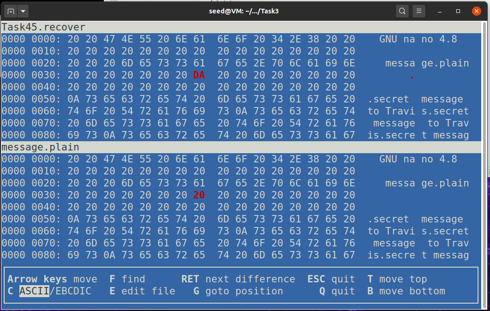
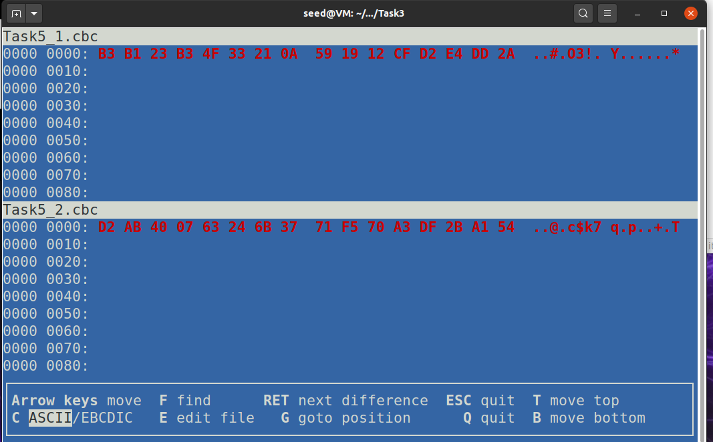
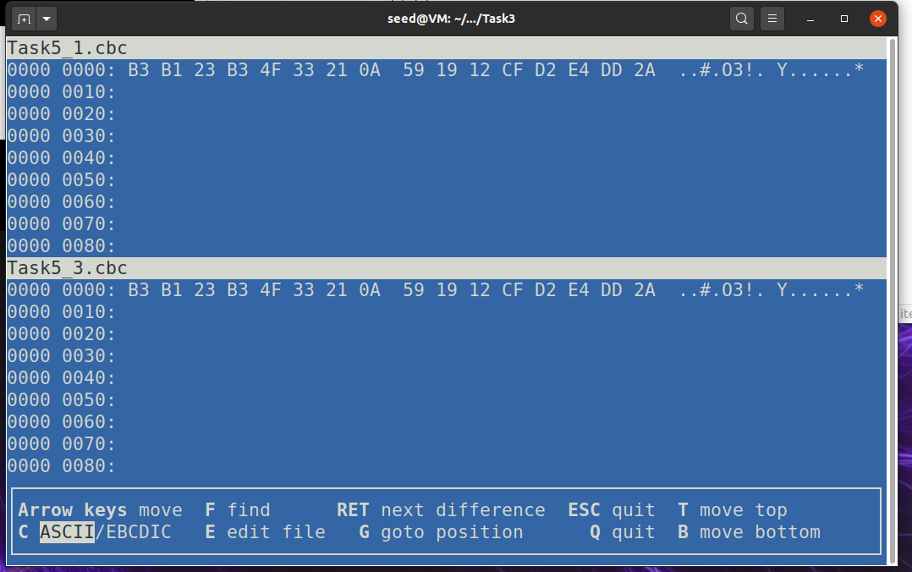

## Lab 06 Secret-Key Encryption Lab
###### Lin Shi (n92s773)
###### linshi1768@gmail.com
###### CSCI 476
###### April 6, 2021
<br>

### Task 1:
In this task, we are trying a few encryption methods:
```
[04/08/21]seed@VM:~/.../06_ske$ openssl enc -aes-128-cbc -e -in plain.txt -out cipher.cbc -K 00112233445566778899AABBCCDDEEFF -iv 000102030405060708090A0B0C0D0E0F -p
salt=2013000000000000
key=00112233445566778899AABBCCDDEEFF
iv =000102030405060708090A0B0C0D0E0F
[04/08/21]seed@VM:~/.../06_ske$ openssl enc -aes-128-ofb -e -in plain.txt -out cipher.ofb -K 00112233445566778899AABBCCDDEEFF -iv 000102030405060708090A0B0C0D0E0F -p
salt=2013000000000000
key=00112233445566778899AABBCCDDEEFF
iv =000102030405060708090A0B0C0D0E0F
[04/08/21]seed@VM:~/.../06_ske$ openssl enc -aes-128-cfb -e -in plain.txt -out cipher.cfb -K 00112233445566778899AABBCCDDEEFF -iv 000102030405060708090A0B0C0D0E0F -p
salt=2013000000000000
key=00112233445566778899AABBCCDDEEFF
iv =000102030405060708090A0B0C0D0E0F
[04/08/21]seed@VM:~/.../06_ske$ rm cipher.bin
[04/08/21]seed@VM:~/.../06_ske$ ls -l
total 28
-rw-rw-r-- 1 seed seed   16 Apr  8 11:01 cipher.cbc
-rw-rw-r-- 1 seed seed   15 Apr  8 11:02 cipher.cfb
-rw-rw-r-- 1 seed seed   15 Apr  8 11:01 cipher.ofb
-rw-rw-r-- 1 seed seed  419 Apr  5 18:59 docker-compose.yml
drwxrwxr-x 2 seed seed 4096 Apr  7 16:06 encryption_oracle
drwxrwxr-x 2 seed seed 4096 Apr  8 10:41 files
-rw-rw-r-- 1 seed seed   15 Apr  8 10:12 plain.txt
[04/08/21]seed@VM:~/.../06_ske$ hexdump cipher.cbc
0000000 b234 c75c 02ba d1ff 8372 bf1f 32d0 df26
0000010
[04/08/21]seed@VM:~/.../06_ske$ hexdump cipher.cfb
0000000 f753 39de 1b55 7e60 fefc 84ed 9ab4 00ea
000000f
[04/08/21]seed@VM:~/.../06_ske$ hexdump cipher.ofb
0000000 f753 39de 1b55 7e60 fefc 84ed 9ab4 00ea
000000f
```
As we can see, CBC encryption file size has increased due to padding. However, both CFB and OFB encryption files size did not increase. Additionally, when we dump the hex out, we can see the CFB and OFB have the same output.

### Task 2:

##### Task 2.1:
In this task, we are trying to encrypt a bmp file using ECB and CBC, but first, I extracted the original header for later use:
```
[04/08/21]seed@VM:~/.../files$ head -c 54 pic_original.bmp > header
[04/08/21]seed@VM:~/.../files$ tail -c +55 pic_original.bmp  > data
[04/08/21]seed@VM:~/.../files$ cat header data > new.bmp
```
Header:
```
42 4D 8E D2 02 00 00 00 00 00 36 00 00 00 28 00 00 00 CC 01 00 00 86 00 00 00 01 00 18 00 00 00 00 00 58 D2 02 00 00 00 00 00 00 00 00 00 00 00 00 00 00 00 00 00
```

Then I encrypted it with CBC and use bless to modify the header:
```
[04/08/21]seed@VM:~/.../files$ bless header
...
[04/08/21]seed@VM:~/.../files$ openssl enc -aes-128-cbc -e -in pic_original.bmp -out cbc.bmp -K 00112233445566778899AABBCCDDEEFF -iv 000102030405060708090A0B0C0D0E0F -p
salt=2013000000000000
key=00112233445566778899AABBCCDDEEFF
iv =000102030405060708090A0B0C0D0E0F
[04/08/21]seed@VM:~/.../files$ bless cbc.bmp
```


As we can see everything to the picture has been encrypted. Then, we do the same for ECB:

```
[04/08/21]seed@VM:~/.../files$ openssl enc -aes-128-ecb -e -in pic_original.bmp -out ecb.bmp -K 00112233445566778899AABBCCDDEEFF -iv 000102030405060708090A0B0C0D0E0F -p
warning: iv not used by this cipher
salt=2013000000000000
key=00112233445566778899AABBCCDDEEFF
[04/08/21]seed@VM:~/.../files$ bless ecb.bmp
```


This time, we can see some outlines to the picture that we encrypted. Therefore, we conclude that CBC is a better encryption at least for the bmp images, since there will not even have any outlines for others to see.

##### Task 2.2:
This time, we are using our own image, I have used a penguin image and convert it to bmp online. (I know convert could be used for that; however, I was having difficulty using it).
```
42 4D 3A B2 0B 00 00 00 00 00 7A 00 00 00 6C 00 00 00 90 01 00 00 21 FE FF FF 01 00 20 00 03 00 00 00 C0 B1 0B 00 13 0B 00 00 13 0B 00 00 00 00 00 00 00 00 00 00
```
```
[04/08/21]seed@VM:~/.../files$ head -c 54 penguin.bmp > penHead
[04/08/21]seed@VM:~/.../files$ openssl enc -aes-128-cbc -e -in penguin.bmp -out penCbc.bmp -K 00112233445566778899AABBCCDDEEFF -iv 000102030405060708090A0B0C0D0E0F -p
salt=2013000000000000
key=00112233445566778899AABBCCDDEEFF
iv =000102030405060708090A0B0C0D0E0F
[04/08/21]seed@VM:~/.../files$ bless penCbc.bmp
```


ECB version:
```
[04/08/21]seed@VM:~/.../files$ openssl enc -aes-128-ecb -e -in penguin.bmp -out penEcb.bmp -K 00112233445566778899AABBCCDDEEFF -iv 000102030405060708090A0B0C0D0E0F -p
warning: iv not used by this cipher
salt=2013000000000000
key=00112233445566778899AABBCCDDEEFF
[04/08/21]seed@VM:~/.../files$ bless penEcb.bmp
```


Once again, I used head to retrieve the header. Then I encrypt the whole image and change the header of the newly modified image back to the original. Also, in the ECB image, we can see the outline of the original penguin. However, in the CBC, we cannot.

### Task 3:

##### Task 3.1:
In this task, we are exploring the padding aspect of encryption:
```
[04/08/21]seed@VM:~/.../Task3$ echo -n "12345" > f1.txt
[04/08/21]seed@VM:~/.../Task3$ echo -n "1234567890" > f2.txt
[04/08/21]seed@VM:~/.../Task3$ echo -n "1234567890123456" > f3.txt
[04/08/21]seed@VM:~/.../Task3$ ls -l
total 12
-rw-rw-r-- 1 seed seed  5 Apr  8 11:49 f1.txt
-rw-rw-r-- 1 seed seed 10 Apr  8 11:49 f2.txt
-rw-rw-r-- 1 seed seed 16 Apr  8 11:49 f3.txt
```
I have created the three files that contains 5, 10, 16 bytes respectively.

```
[04/08/21]seed@VM:~/.../Task3$ openssl enc -aes-128-cbc -e -in f1.txt -out f1.cbc -K 00112233445566778899AABBCCDDEEFF -iv 000102030405060708090A0B0C0D0E0F -p
salt=2013000000000000
key=00112233445566778899AABBCCDDEEFF
iv =000102030405060708090A0B0C0D0E0F
[04/08/21]seed@VM:~/.../Task3$ openssl enc -aes-128-cbc -e -in f2.txt -out f2.cbc -K 00112233445566778899AABBCCDDEEFF -iv 000102030405060708090A0B0C0D0E0F -p
salt=2013000000000000
key=00112233445566778899AABBCCDDEEFF
iv =000102030405060708090A0B0C0D0E0F
[04/08/21]seed@VM:~/.../Task3$ openssl enc -aes-128-cbc -e -in f3.txt -out f3.cbc -K 00112233445566778899AABBCCDDEEFF -iv 000102030405060708090A0B0C0D0E0F -p
salt=2013000000000000
key=00112233445566778899AABBCCDDEEFF
iv =000102030405060708090A0B0C0D0E0F
[04/08/21]seed@VM:~/.../Task3$ ls -l
total 24
-rw-rw-r-- 1 seed seed 16 Apr  8 11:52 f1.cbc
-rw-rw-r-- 1 seed seed  5 Apr  8 11:49 f1.txt
-rw-rw-r-- 1 seed seed 16 Apr  8 11:52 f2.cbc
-rw-rw-r-- 1 seed seed 10 Apr  8 11:49 f2.txt
-rw-rw-r-- 1 seed seed 32 Apr  8 11:52 f3.cbc
-rw-rw-r-- 1 seed seed 16 Apr  8 11:49 f3.txt
```
After the encryption, we can see that all CBC files are using an increment of 8 bytes. For the 5 bytes, we can see that it uses 16 bytes, so we can concluded that CBC for padding is greater than 3 bytes. Then for the 10 bytes, we are still using 16 bytes, so it is less than 6 bytes. Overall, we can conclude that CBC contains some byte of padding.


##### Task 3.2:
In this task, we are doing the ECB, CFB, and OFB files:
```
[04/08/21]seed@VM:~/.../Task3$ openssl enc -aes-128-ecb -e -in f1.txt -out f1.ecb -K 00112233445566778899AABBCCDDEEFF -iv 000102030405060708090A0B0C0D0E0F -p
warning: iv not used by this cipher
salt=2013000000000000
key=00112233445566778899AABBCCDDEEFF
[04/08/21]seed@VM:~/.../Task3$ openssl enc -aes-128-ecb -e -in f2.txt -out f2.ecb -K 00112233445566778899AABBCCDDEEFF -iv 000102030405060708090A0B0C0D0E0F -p
warning: iv not used by this cipher
salt=2013000000000000
key=00112233445566778899AABBCCDDEEFF
[04/08/21]seed@VM:~/.../Task3$ openssl enc -aes-128-ecb -e -in f3.txt -out f3.ecb -K 00112233445566778899AABBCCDDEEFF -iv 000102030405060708090A0B0C0D0E0F -p
warning: iv not used by this cipher
salt=2013000000000000
key=00112233445566778899AABBCCDDEEFF
[04/08/21]seed@VM:~/.../Task3$ openssl enc -aes-128-cfb -e -in f1.txt -out f1.cfb -K 00112233445566778899AABBCCDDEEFF -iv 000102030405060708090A0B0C0D0E0F -p
salt=2013000000000000
key=00112233445566778899AABBCCDDEEFF
iv =000102030405060708090A0B0C0D0E0F
[04/08/21]seed@VM:~/.../Task3$ openssl enc -aes-128-cfb -e -in f2.txt -out f2.cfb -K 00112233445566778899AABBCCDDEEFF -iv 000102030405060708090A0B0C0D0E0F -p
salt=2013000000000000
key=00112233445566778899AABBCCDDEEFF
iv =000102030405060708090A0B0C0D0E0F
[04/08/21]seed@VM:~/.../Task3$ openssl enc -aes-128-cfb -e -in f3.txt -out f3.cfb -K 00112233445566778899AABBCCDDEEFF -iv 000102030405060708090A0B0C0D0E0F -p
salt=2013000000000000
key=00112233445566778899AABBCCDDEEFF
iv =000102030405060708090A0B0C0D0E0F
[04/08/21]seed@VM:~/.../Task3$ openssl enc -aes-128-ofb -e -in f1.txt -out f1.ofb -K 00112233445566778899AABBCCDDEEFF -iv 000102030405060708090A0B0C0D0E0F -p
salt=2013000000000000
key=00112233445566778899AABBCCDDEEFF
iv =000102030405060708090A0B0C0D0E0F
[04/08/21]seed@VM:~/.../Task3$ openssl enc -aes-128-ofb -e -in f2.txt -out f2.ofb -K 00112233445566778899AABBCCDDEEFF -iv 000102030405060708090A0B0C0D0E0F -p
salt=2013000000000000
key=00112233445566778899AABBCCDDEEFF
iv =000102030405060708090A0B0C0D0E0F
[04/08/21]seed@VM:~/.../Task3$ openssl enc -aes-128-ofb -e -in f3.txt -out f3.ofb -K 00112233445566778899AABBCCDDEEFF -iv 000102030405060708090A0B0C0D0E0F -p
salt=2013000000000000
key=00112233445566778899AABBCCDDEEFF
iv =000102030405060708090A0B0C0D0E0F
```

```
[04/08/21]seed@VM:~/.../Task3$ ls -l
total 60
-rw-rw-r-- 1 seed seed 16 Apr  8 11:52 f1.cbc
-rw-rw-r-- 1 seed seed  5 Apr  8 11:57 f1.cfb
-rw-rw-r-- 1 seed seed 16 Apr  8 11:56 f1.ecb
-rw-rw-r-- 1 seed seed  5 Apr  8 11:57 f1.ofb
-rw-rw-r-- 1 seed seed  5 Apr  8 11:49 f1.txt
-rw-rw-r-- 1 seed seed 16 Apr  8 11:52 f2.cbc
-rw-rw-r-- 1 seed seed 10 Apr  8 11:57 f2.cfb
-rw-rw-r-- 1 seed seed 16 Apr  8 11:56 f2.ecb
-rw-rw-r-- 1 seed seed 10 Apr  8 11:57 f2.ofb
-rw-rw-r-- 1 seed seed 10 Apr  8 11:49 f2.txt
-rw-rw-r-- 1 seed seed 32 Apr  8 11:55 f3.cbc
-rw-rw-r-- 1 seed seed 16 Apr  8 11:57 f3.cfb
-rw-rw-r-- 1 seed seed 32 Apr  8 11:56 f3.ecb
-rw-rw-r-- 1 seed seed 16 Apr  8 11:58 f3.ofb
-rw-rw-r-- 1 seed seed 16 Apr  8 11:49 f3.txt
```
Based on the output, CBC and ECB have padding but OFB and CFB does not. Both CFB and OFB does not add extra bytes in if it is not an increment of 8. However, CBC and ECB make sure everything is an increment of 8.

### Task 4:

##### Task 4.1:
Based on how ECB, CBC, CFB, and OFB treats padding, I assume that the at least 8 bytes will not be recoverable for CBC and ECB. CFB and OFB will only lose the one byte that I change.

##### Task 4.2:
In this task, I am trying to encrypt an message, corrupt it, and decrypt the message. First, here is a piece of the byte code of my text file to show that it is more than 1000 bytes long:
```
...
000006c0: 6973 0a
```
Then I encrypt the message using ECB, use bless to corrupt it, and decrypt it using the same key. In the end, I used vbindiff to check for the difference between the decrypt message and the original message.
```
[04/08/21]seed@VM:~/.../Task3$ openssl enc -aes-128-ecb -e -in message.plain -out Task42.ecb -K 00112233445566778899AABBCCDDEEFF -iv 000102030405060708090A0B0C0D0E0F -p
warning: iv not used by this cipher
salt=2013000000000000
key=00112233445566778899AABBCCDDEEFF
[04/08/21]seed@VM:~/.../Task3$ bless Task42.ecb
[04/08/21]seed@VM:~/.../Task3$ openssl enc -aes-128-ecb -d -in Task42.ecb -out Task42.recover -K 00112233445566778899AABBCCDDEEFF -iv 000102030405060708090A0B0C0D0E0F -p
warning: iv not used by this cipher
salt=2013000000000000
key=00112233445566778899AABBCCDDEEFF
[04/08/21]seed@VM:~/.../Task3$ vbindiff Task42.recover message.plain
```


As I excepted, we have lost 16 bytes in total. However, I thought it was going to lose just 8 bytes. However, assuming that 20 is some kind of filler, the whole 16 bytes has been altered. Overall, we have recovered everything else.

##### Task 4.3:
We are doing the same thing but using CBC encryption:
```
[04/08/21]seed@VM:~/.../Task3$ openssl enc -aes-128-cbc -e -in message.plain -out Task43.cbc -K 00112233445566778899AABBCCDDEEFF -iv 000102030405060708090A0B0C0D0E0F -p
salt=2013000000000000
key=00112233445566778899AABBCCDDEEFF
iv =000102030405060708090A0B0C0D0E0F
[04/08/21]seed@VM:~/.../Task3$ bless Task43.cbc
Gtk-Message: 12:20:27.816: Failed to load module "canberra-gtk-module"
Could not find a part of the path '/home/seed/.config/bless/plugins'.
Could not find a part of the path '/home/seed/.config/bless/plugins'.
Could not find a part of the path '/home/seed/.config/bless/plugins'.
Could not find file "/home/seed/.config/bless/export_patterns"
[04/08/21]seed@VM:~/.../Task3$ openssl enc -aes-128-cbc -d -in Task43.cbc -out Task43.recover -K 00112233445566778899AABBCCDDEEFF -iv 000102030405060708090A0B0C0D0E0F -p
salt=2013000000000000
key=00112233445566778899AABBCCDDEEFF
iv =000102030405060708090A0B0C0D0E0F
[04/08/21]seed@VM:~/.../Task3$ vbindiff Task43.recover message.plain
```


This time, we lost 17 bytes. We changed a filler(20) and it modified the 16 bytes prior to this filler. On the other hand, we recovered all other messages.


##### Task 4.4:
This time, we are using CFB:
```
[04/08/21]seed@VM:~/.../Task3$ openssl enc -aes-128-cfb -e -in message.plain -out Task44.cfb -K 00112233445566778899AABBCCDDEEFF -iv 000102030405060708090A0B0C0D0E0F -p
salt=2013000000000000
key=00112233445566778899AABBCCDDEEFF
iv =000102030405060708090A0B0C0D0E0F
[04/08/21]seed@VM:~/.../Task3$ bless Task44.cfb
Gtk-Message: 12:23:07.259: Failed to load module "canberra-gtk-module"
Could not find a part of the path '/home/seed/.config/bless/plugins'.
Could not find a part of the path '/home/seed/.config/bless/plugins'.
Could not find a part of the path '/home/seed/.config/bless/plugins'.
Could not find file "/home/seed/.config/bless/export_patterns"
[04/08/21]seed@VM:~/.../Task3$ openssl enc -aes-128-cfb -d -in Task44.cfb -out Task44.recover -K 00112233445566778899AABBCCDDEEFF -iv 000102030405060708090A0B0C0D0E0F -p
salt=2013000000000000
key=00112233445566778899AABBCCDDEEFF
iv =000102030405060708090A0B0C0D0E0F
[04/08/21]seed@VM:~/.../Task3$ vbindiff Task44.recover message.plain
```


In CFB, we lost the byte that we modify as well as the next set of 16 bytes. Since we changed the filled, it will altered the next 16 bytes. Aside from that, we have recovered everything else.

##### Task 4.5:
In this task, we are using OFB:
```
[04/08/21]seed@VM:~/.../Task3$ openssl enc -aes-128-ofb -e -in message.plain -out Task45.ofb -K 00112233445566778899AABBCCDDEEFF -iv 000102030405060708090A0B0C0D0E0F -p
salt=2013000000000000
key=00112233445566778899AABBCCDDEEFF
iv =000102030405060708090A0B0C0D0E0F
[04/08/21]seed@VM:~/.../Task3$ bless Task45.ofb
Gtk-Message: 12:27:34.298: Failed to load module "canberra-gtk-module"
Could not find a part of the path '/home/seed/.config/bless/plugins'.
Could not find a part of the path '/home/seed/.config/bless/plugins'.
Could not find a part of the path '/home/seed/.config/bless/plugins'.
Could not find file "/home/seed/.config/bless/export_patterns"
^C
[04/08/21]seed@VM:~/.../Task3$ openssl enc -aes-128-ofb -d -in Task45.ofb -out Task45.recover -K 00112233445566778899AABBCCDDEEFF -iv 000102030405060708090A0B0C0D0E0F -p
salt=2013000000000000
key=00112233445566778899AABBCCDDEEFF
iv =000102030405060708090A0B0C0D0E0F
[04/08/21]seed@VM:~/.../Task3$ vbindiff Task45.recover message.plain
```


In OFB, we have lost just one byte, the byte that we modify. Therefore, changing some filler would not affect OFB.


### Task 5:
In this task, we are looking at the importance of changing IVs:
```
[04/08/21]seed@VM:~/.../Task3$ nano secret.plain
[04/08/21]seed@VM:~/.../Task3$ openssl enc -aes-128-cbc -e -in secret.plain -out Task5_1.cbc -K 00112233445566778899AABBCCDDEEFF -iv 000102030405060708090A0B0C0D0E0F -p
salt=2013000000000000
key=00112233445566778899AABBCCDDEEFF
iv =000102030405060708090A0B0C0D0E0F
[04/08/21]seed@VM:~/.../Task3$  openssl enc -aes-128-cbc -e -in secret.plain -out Task5_2.cbc -K 00112233445566778899AABBCCDDEEFF -iv 0F0E0D0C0B0A09080706050403020100 -p
salt=2013000000000000
key=00112233445566778899AABBCCDDEEFF
iv =0F0E0D0C0B0A09080706050403020100
[04/08/21]seed@VM:~/.../Task3$ vbindiff Task5_1.cbc Task5_2.cbc

```


We encrypted the secret text with CBC twice using different IVs and store the information separately. As we can see the whole message has been different by using different IVs. Then I did one with the same IV as the first attempt and compared results:
```
[04/08/21]seed@VM:~/.../Task3$ openssl enc -aes-128-cbc -e -in secret.plain -out Task5_3.cbc -K 00112233445566778899AABBCCDDEEFF -iv 000102030405060708090A0B0C0D0E0F -p
salt=2013000000000000
key=00112233445566778899AABBCCDDEEFF
iv =000102030405060708090A0B0C0D0E0F
[04/08/21]seed@VM:~/.../Task3$ vbindiff Task5_1.cbc Task5_3.cbc
```


As we can see the encrypted version has been the same. Thus, we can see the importance of changing IVs when encrypting since it could be unsafe if we are using the same IVs over and over.
