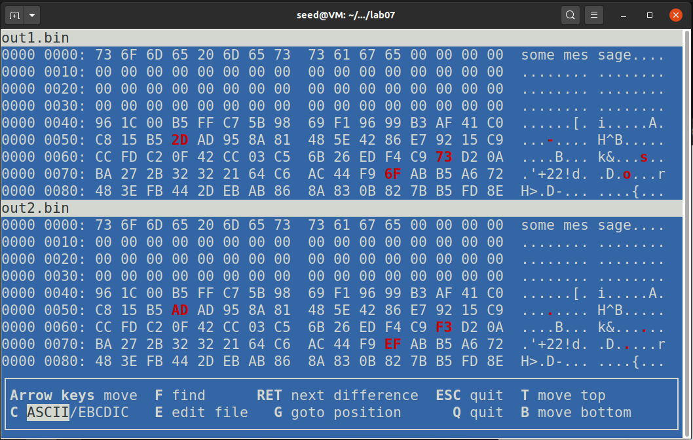
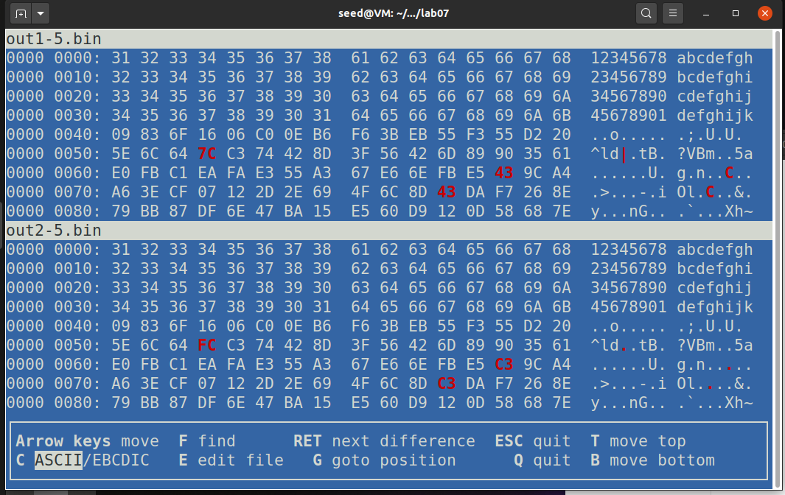
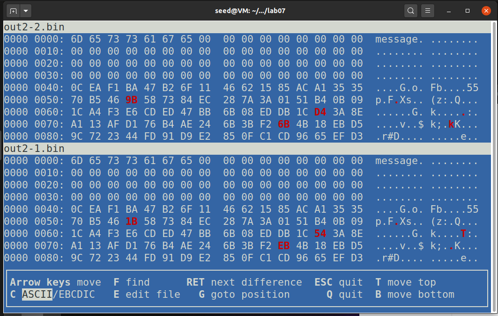
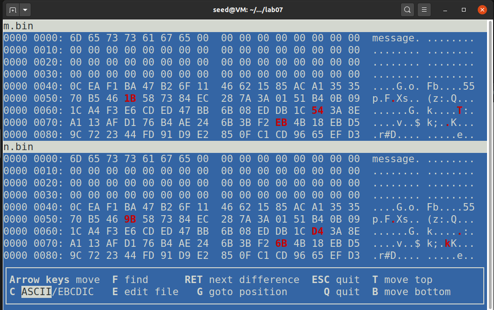

## Lab 07 MD5 Collision Attack Lab
###### Lin Shi (n92s773)
###### linshi1768@gmail.com
###### CSCI 476
###### April 13, 2021
<br>

### Task 1:

##### Task 1.1:
In this task, we are generating different files with the same md5 hash:
```
[04/15/21]seed@VM:~/.../lab07$ echo -n "some message" > prefix.txt
[04/15/21]seed@VM:~/.../lab07$ md5collgen -p prefix.txt -o out1.bin out2.bin
MD5 collision generator v1.5
by Marc Stevens (http://www.win.tue.nl/hashclash/)

Using output filenames: 'out1.bin' and 'out2.bin'
Using prefixfile: 'prefix.txt'
Using initial value: a60ad44b2f27500f70634ff1ef4990c8

Generating first block: ..........
Generating second block: S01.....
Running time: 6.52397 s
[04/15/21]seed@VM:~/.../lab07$ xxd out1.bin
00000000: 736f 6d65 206d 6573 7361 6765 0000 0000  some message....
00000010: 0000 0000 0000 0000 0000 0000 0000 0000  ................
00000020: 0000 0000 0000 0000 0000 0000 0000 0000  ................
00000030: 0000 0000 0000 0000 0000 0000 0000 0000  ................
00000040: 961c 00b5 ffc7 5b98 69f1 9699 b3af 41c0  ......[.i.....A.
00000050: c815 b52d ad95 8a81 485e 4286 e792 15c9  ...-....H^B.....
00000060: ccfd c20f 42cc 03c5 6b26 edf4 c973 d20a  ....B...k&...s..
00000070: ba27 2b32 3221 64c6 ac44 f96f abb5 a672  .'+22!d..D.o...r
00000080: 483e fb44 2deb ab86 8a83 0b82 7bb5 fd8e  H>.D-.......{...
00000090: 3cdd 3886 33c6 26ad d31a fe4c ec07 02ee  <.8.3.&....L....
000000a0: e81b 9e9b 060d e743 aa8b 4037 76d8 592a  .......C..@7v.Y*
000000b0: 2b5a 1c6e 28a4 56b1 395c b325 65ab 399e  +Z.n(.V.9\.%e.9.
[04/15/21]seed@VM:~/.../lab07$ xxd out2.bin
00000000: 736f 6d65 206d 6573 7361 6765 0000 0000  some message....
00000010: 0000 0000 0000 0000 0000 0000 0000 0000  ................
00000020: 0000 0000 0000 0000 0000 0000 0000 0000  ................
00000030: 0000 0000 0000 0000 0000 0000 0000 0000  ................
00000040: 961c 00b5 ffc7 5b98 69f1 9699 b3af 41c0  ......[.i.....A.
00000050: c815 b5ad ad95 8a81 485e 4286 e792 15c9  ........H^B.....
00000060: ccfd c20f 42cc 03c5 6b26 edf4 c9f3 d20a  ....B...k&......
00000070: ba27 2b32 3221 64c6 ac44 f9ef abb5 a672  .'+22!d..D.....r
00000080: 483e fb44 2deb ab86 8a83 0b82 7bb5 fd8e  H>.D-.......{...
00000090: 3cdd 3806 33c6 26ad d31a fe4c ec07 02ee  <.8.3.&....L....
000000a0: e81b 9e9b 060d e743 aa8b 4037 7658 592a  .......C..@7vXY*
000000b0: 2b5a 1c6e 28a4 56b1 395c b3a5 65ab 399e  +Z.n(.V.9\..e.9.
[04/15/21]seed@VM:~/.../lab07$ diff out1.bin out2.bin
Binary files out1.bin and out2.bin differ
[04/15/21]seed@VM:~/.../lab07$ md5sum out1.bin
cfe1fb6bf48184995be35ac749138921  out1.bin
[04/15/21]seed@VM:~/.../lab07$ md5sum out2.bin
cfe1fb6bf48184995be35ac749138921  out2.bin
[04/15/21]seed@VM:~/.../lab07$ vbindiff out1.bin out2.bin
```

As you can see, I first added some random information in the prefix. Then I did a md5 hash of the prefix. When I checked for the difference among the two files, I can see it saying the two files are different. However, its md5sum are the same. Then I used the vbindiff to look for the differences and the difference is only a few bytes.

##### Task 1.2:
As seen in the previous image for difference, when we do not have 64 bytes for the prefix, it is padded with 00 all the way up to 40, which is 64 in decimal. Therefore, we can conclude that if the prefix is not at least 64 bytes long, it will be padded until it is 64 bytes long. Same idea would apply to any multiple of 64.

##### Task 1.3:
For this task, we are observing what would happen if the prefix is 64 bytes long.
```
[04/15/21]seed@VM:~/.../lab07$ echo -n "12345678abcdefgh23456789bcdefghi34567890cdefghij45678901defghijk" > prefix.txt
[04/15/21]seed@VM:~/.../lab07$ ls -l prefix.txt
-rw-rw-r-- 1 seed seed 64 Apr 15 04:23 prefix.txt
[04/15/21]seed@VM:~/.../lab07$ md5collgen -p prefix.txt -o out1-5.bin out2-5.binMD5 collision generator v1.5
by Marc Stevens (http://www.win.tue.nl/hashclash/)

Using output filenames: 'out1-5.bin' and 'out2-5.bin'
Using prefixfile: 'prefix.txt'
Using initial value: 1b31944a7d63f8ccb255d258debfd486

Generating first block: ...............
Generating second block: S00.....................
Running time: 17.732 s
[04/15/21]seed@VM:~/.../lab07$ diff out1-5.bin out2-5.bin
1c1
< 12345678abcdefgh23456789bcdefghi34567890cdefghij45678901defghijk	�o���;�UXh~���.xa�W��Y2�i�f{�PiD��S��'.ԭ�nY�r���}iOl�C��&�y���nG��`�
\ No newline at end of file
---
> 12345678abcdefgh23456789bcdefghi34567890cdefghij45678901defghijk	�o���;�UXh~����xa�W��Y2�i�f{�PiD���R��'.ԭ�nY�����}l����&�y���nG��`�
\ No newline at end of file
[04/15/21]seed@VM:~/.../lab07$ xxd out1-5.bin
00000000: 3132 3334 3536 3738 6162 6364 6566 6768  12345678abcdefgh
00000010: 3233 3435 3637 3839 6263 6465 6667 6869  23456789bcdefghi
00000020: 3334 3536 3738 3930 6364 6566 6768 696a  34567890cdefghij
00000030: 3435 3637 3839 3031 6465 6667 6869 6a6b  45678901defghijk
00000040: 0983 6f16 06c0 0eb6 f63b eb55 f355 d220  ..o......;.U.U.
00000050: 5e6c 647c c374 428d 3f56 426d 8990 3561  ^ld|.tB.?VBm..5a
00000060: e0fb c1ea fae3 55a3 67e6 6efb e543 9ca4  ......U.g.n..C..
00000070: a63e cf07 122d 2e69 4f6c 8d43 daf7 268e  .>...-.iOl.C..&.
00000080: 79bb 87df 6e47 ba15 e560 d912 0d58 687e  y...nG...`...Xh~
00000090: c0ba ae2e 0278 6116 c557 16c5 cd19 5932  .....xa..W....Y2
000000a0: b369 17fa 667b 8250 6944 cc0f 9012 53aa  .i..f{.PiD....S.
000000b0: a527 2e1e d4ad e7ab 6e59 8472 edb6 ed7d  .'......nY.r...}
[04/15/21]seed@VM:~/.../lab07$ xxd out2-5.bin
00000000: 3132 3334 3536 3738 6162 6364 6566 6768  12345678abcdefgh
00000010: 3233 3435 3637 3839 6263 6465 6667 6869  23456789bcdefghi
00000020: 3334 3536 3738 3930 6364 6566 6768 696a  34567890cdefghij
00000030: 3435 3637 3839 3031 6465 6667 6869 6a6b  45678901defghijk
00000040: 0983 6f16 06c0 0eb6 f63b eb55 f355 d220  ..o......;.U.U.
00000050: 5e6c 64fc c374 428d 3f56 426d 8990 3561  ^ld..tB.?VBm..5a
00000060: e0fb c1ea fae3 55a3 67e6 6efb e5c3 9ca4  ......U.g.n.....
00000070: a63e cf07 122d 2e69 4f6c 8dc3 daf7 268e  .>...-.iOl....&.
00000080: 79bb 87df 6e47 ba15 e560 d912 0d58 687e  y...nG...`...Xh~
00000090: c0ba aeae 0278 6116 c557 16c5 cd19 5932  .....xa..W....Y2
000000a0: b369 17fa 667b 8250 6944 cc0f 9092 52aa  .i..f{.PiD....R.
000000b0: a527 2e1e d4ad e7ab 6e59 84f2 edb6 ed7d  .'......nY.....}
[04/15/21]seed@VM:~/.../lab07$ md5sum out1-5.bin
f12198b5019905757ade4dee23145fb0  out1-5.bin
[04/15/21]seed@VM:~/.../lab07$ md5sum out2-5.bin
f12198b5019905757ade4dee23145fb0  out2-5.bin
[04/15/21]seed@VM:~/.../lab07$ vbindiff out1-5.bin out2-5.bin
```


This time, I have added a prefix with the length of 64. When I observe the new file, the 00 are not there. Therefore, if the prefix is 64 bytes long, it will just use that for the prefix without any modification. Additionally, the diff command will give a little extra information on the difference among the two files. On the other hand, its md5sums are the same. 

##### Task 1.4:
The data are not completely different; however they are different to a degree. 7C(|) is FC(.), 43(C) is C3(.), CC(.) is 4C(L), 3B(;) is BB(.), 52(R) is D2(.), 83(.) is 03(.), A1(.) is A2(.) 5A(Z) is DA(.). In total, we have 8 differences and with the exception of A1 to A2, they all vary in 128 or -128. Which is all the differences among the two files. If you would take C3-43, the difference is 80, which is 128 in decimal. Same thing applies to FC-7C. Therefore, since the data (128 bytes) are generated, it might include some differences with a offset of 128. However, if we do the md5sum of them, they are the same.


### Task 2:
In this task, we are generating an experiment to test md5 for suffix extension:
```
[04/15/21]seed@VM:~/.../lab07$ md5collgen -p task2.txt -o out2-1.bin out2-2.bin
MD5 collision generator v1.5
by Marc Stevens (http://www.win.tue.nl/hashclash/)

Using output filenames: 'out2-1.bin' and 'out2-2.bin'
Using prefixfile: 'task2.txt'
Using initial value: 47d16274718bbbeb3503ed9f5130172e

Generating first block: .......................
Generating second block: W..........
Running time: 16.6161 s
[04/15/21]seed@VM:~/.../lab07$ diff out2-1.bin out2-2.bin
Binary files out2-1.bin and out2-2.bin differ
[04/15/21]seed@VM:~/.../lab07$ xxd out2-1.bin
00000000: 6d65 7373 6167 6500 0000 0000 0000 0000  message.........
00000010: 0000 0000 0000 0000 0000 0000 0000 0000  ................
00000020: 0000 0000 0000 0000 0000 0000 0000 0000  ................
00000030: 0000 0000 0000 0000 0000 0000 0000 0000  ................
00000040: 0cea f1ba 47b2 6f11 4662 1585 aca1 3535  ....G.o.Fb....55
00000050: 70b5 461b 5873 84ec 287a 3a01 51b4 0b09  p.F.Xs..(z:.Q...
00000060: 1ca4 f3e6 cded 47bb 6b08 eddb 1c54 3a8e  ......G.k....T:.
00000070: a113 afd1 76b4 ae24 6b3b f2eb 4b18 ebd5  ....v..$k;..K...
00000080: 9c72 2344 fd91 d9e2 850f c1cd 9665 efd3  .r#D.........e..
00000090: cef5 aa26 01b8 442d 1c99 3c37 4e7c dddd  ...&..D-..<7N|..
000000a0: b5af be4b 691a b4a6 9a7b dda1 8e4c 451d  ...Ki....{...LE.
000000b0: 0515 015f d5c2 a318 c5a1 a9e7 60a0 7b68  ..._........`.{h
[04/15/21]seed@VM:~/.../lab07$ xxd out2-2.bin
00000000: 6d65 7373 6167 6500 0000 0000 0000 0000  message.........
00000010: 0000 0000 0000 0000 0000 0000 0000 0000  ................
00000020: 0000 0000 0000 0000 0000 0000 0000 0000  ................
00000030: 0000 0000 0000 0000 0000 0000 0000 0000  ................
00000040: 0cea f1ba 47b2 6f11 4662 1585 aca1 3535  ....G.o.Fb....55
00000050: 70b5 469b 5873 84ec 287a 3a01 51b4 0b09  p.F.Xs..(z:.Q...
00000060: 1ca4 f3e6 cded 47bb 6b08 eddb 1cd4 3a8e  ......G.k.....:.
00000070: a113 afd1 76b4 ae24 6b3b f26b 4b18 ebd5  ....v..$k;.kK...
00000080: 9c72 2344 fd91 d9e2 850f c1cd 9665 efd3  .r#D.........e..
00000090: cef5 aaa6 01b8 442d 1c99 3c37 4e7c dddd  ......D-..<7N|..
000000a0: b5af be4b 691a b4a6 9a7b dda1 8ecc 441d  ...Ki....{....D.
000000b0: 0515 015f d5c2 a318 c5a1 a967 60a0 7b68  ..._.......g`.{h
[04/15/21]seed@VM:~/.../lab07$ md5sum out2-1.bin
cc6956d0f7ca83109fd1c5026edc9f39  out2-1.bin
[04/15/21]seed@VM:~/.../lab07$ md5sum out2-2.bin
cc6956d0f7ca83109fd1c5026edc9f39  out2-2.bin
[04/15/21]seed@VM:~/.../lab07$ vbindiff out2-2.bin out2-1.bin
```


Up to this point, we are doing the same thing as above. Next, we are going to add the suffix and concatenating it:

```
[04/15/21]seed@VM:~/.../lab07$ echo -n "end" > suffix.txt
[04/15/21]seed@VM:~/.../lab07$ cat out2-1.bin suffix.txt > m.bin
[04/15/21]seed@VM:~/.../lab07$ cat out2-2.bin suffix.txt > n.bin
[04/15/21]seed@VM:~/.../lab07$ diff m.bin n.bin
Binary files m.bin and n.bin differ
[04/15/21]seed@VM:~/.../lab07$ m5sum m.bin

Command 'm5sum' not found, did you mean:

  command 'md5sum' from deb coreutils (8.30-3ubuntu2)
  command 'mdsum' from deb ucommon-utils (7.0.0-16ubuntu2)

Try: sudo apt install <deb name>

[04/15/21]seed@VM:~/.../lab07$ md5dum m.bin

Command 'md5dum' not found, did you mean:

  command 'md5sum' from deb coreutils (8.30-3ubuntu2)

Try: sudo apt install <deb name>

[04/15/21]seed@VM:~/.../lab07$ md5sum m.bin
0fcf4f1db00bb65883d4ad233d600fd9  m.bin
[04/15/21]seed@VM:~/.../lab07$ md5sum n.bin
0fcf4f1db00bb65883d4ad233d600fd9  n.bin
[04/15/21]seed@VM:~/.../lab07$ diff m.bin n.bin
Binary files m.bin and n.bin differ
[04/15/21]seed@VM:~/.../lab07$ xxd m.bin
00000000: 6d65 7373 6167 6500 0000 0000 0000 0000  message.........
00000010: 0000 0000 0000 0000 0000 0000 0000 0000  ................
00000020: 0000 0000 0000 0000 0000 0000 0000 0000  ................
00000030: 0000 0000 0000 0000 0000 0000 0000 0000  ................
00000040: 0cea f1ba 47b2 6f11 4662 1585 aca1 3535  ....G.o.Fb....55
00000050: 70b5 461b 5873 84ec 287a 3a01 51b4 0b09  p.F.Xs..(z:.Q...
00000060: 1ca4 f3e6 cded 47bb 6b08 eddb 1c54 3a8e  ......G.k....T:.
00000070: a113 afd1 76b4 ae24 6b3b f2eb 4b18 ebd5  ....v..$k;..K...
00000080: 9c72 2344 fd91 d9e2 850f c1cd 9665 efd3  .r#D.........e..
00000090: cef5 aa26 01b8 442d 1c99 3c37 4e7c dddd  ...&..D-..<7N|..
000000a0: b5af be4b 691a b4a6 9a7b dda1 8e4c 451d  ...Ki....{...LE.
000000b0: 0515 015f d5c2 a318 c5a1 a9e7 60a0 7b68  ..._........`.{h
000000c0: 656e 64                                  end
[04/15/21]seed@VM:~/.../lab07$ xxd n.bin
00000000: 6d65 7373 6167 6500 0000 0000 0000 0000  message.........
00000010: 0000 0000 0000 0000 0000 0000 0000 0000  ................
00000020: 0000 0000 0000 0000 0000 0000 0000 0000  ................
00000030: 0000 0000 0000 0000 0000 0000 0000 0000  ................
00000040: 0cea f1ba 47b2 6f11 4662 1585 aca1 3535  ....G.o.Fb....55
00000050: 70b5 469b 5873 84ec 287a 3a01 51b4 0b09  p.F.Xs..(z:.Q...
00000060: 1ca4 f3e6 cded 47bb 6b08 eddb 1cd4 3a8e  ......G.k.....:.
00000070: a113 afd1 76b4 ae24 6b3b f26b 4b18 ebd5  ....v..$k;.kK...
00000080: 9c72 2344 fd91 d9e2 850f c1cd 9665 efd3  .r#D.........e..
00000090: cef5 aaa6 01b8 442d 1c99 3c37 4e7c dddd  ......D-..<7N|..
000000a0: b5af be4b 691a b4a6 9a7b dda1 8ecc 441d  ...Ki....{....D.
000000b0: 0515 015f d5c2 a318 c5a1 a967 60a0 7b68  ..._.......g`.{h
000000c0: 656e 64                                  end
[04/15/21]seed@VM:~/.../lab07$ vbindiff m.bin n.bin
```


As we can see, everything has stayed the same, the only difference is within the data that we generate (and they are all offsetting by 128). Therefore, we can conclude that adding a suffix does not change it; thus, the property holds with md5.

### Task 3:
In this task, we are generating two executables files with the same md5 hash, I have cut the xxd of task3.out to just the data that we would like to see:
```
[04/15/21]seed@VM:~/.../lab07$ nano program.c
[04/15/21]seed@VM:~/.../lab07$ gcc program.c -o task3.out
[04/15/21]seed@VM:~/.../lab07$ xxd task3.out
...
00003020: 4141 4141 4141 4141 4141 4141 4141 4141  AAAAAAAAAAAAAAAA
00003030: 4141 4141 4141 4141 4141 4141 4141 4141  AAAAAAAAAAAAAAAA
00003040: 4141 4141 4141 4141 4141 4141 4141 4141  AAAAAAAAAAAAAAAA
00003050: 4141 4141 4141 4141 4141 4141 4141 4141  AAAAAAAAAAAAAAAA
00003060: 4141 4141 4141 4141 4141 4141 4141 4141  AAAAAAAAAAAAAAAA
00003070: 4141 4141 4141 4141 4141 4141 4141 4141  AAAAAAAAAAAAAAAA
00003080: 4141 4141 4141 4141 4141 4141 4141 4141  AAAAAAAAAAAAAAAA
00003090: 4141 4141 4141 4141 4141 4141 4141 4141  AAAAAAAAAAAAAAAA
000030a0: 4141 4141 4141 4141 4141 4141 4141 4141  AAAAAAAAAAAAAAAA
000030b0: 4141 4141 4141 4141 4141 4141 4141 4141  AAAAAAAAAAAAAAAA
000030c0: 4141 4141 4141 4141 4141 4141 4141 4141  AAAAAAAAAAAAAAAA
000030d0: 4141 4141 4141 4141 4141 4141 4141 4141  AAAAAAAAAAAAAAAA
000030e0: 4141 4141 4141 4141 4743 433a 2028 5562  AAAAAAAAGCC: (Ub
000030f0: 756e 7475 2039 2e33 2e30 2d31 3775 6275  untu 9.3.0-17ubu
00003100: 6e74 7531 7e32 302e 3034 2920 392e 332e  ntu1~20.04) 9.3.
...
[04/15/21]seed@VM:~/.../lab07$ head -c 12288 task3.out > prefix
[04/15/21]seed@VM:~/.../lab07$ head -c 12352 task3.out > prefix
[04/15/21]seed@VM:~/.../lab07$ tail -c +12480 task3.out > suffix
[04/15/21]seed@VM:~/.../lab07$ md5collgen -p prefix -o prefix1.bin prefix2.bin
MD5 collision generator v1.5
by Marc Stevens (http://www.win.tue.nl/hashclash/)

Using output filenames: 'prefix1.bin' and 'prefix2.bin'
Using prefixfile: 'prefix'
Using initial value: d8dc45dde7e4dba3702ff8377c463b1f

Generating first block: ....
Generating second block: S10...............................
Running time: 3.27924 s
[04/15/21]seed@VM:~/.../lab07$ cat prefix1.bin suffix > program1.out
[04/15/21]seed@VM:~/.../lab07$ cat prefix2.bin suffix > program2.out
[04/15/21]seed@VM:~/.../lab07$ ls -l program1.out
-rw-rw-r-- 1 seed seed 16993 Apr 15 10:45 program1.out
[04/15/21]seed@VM:~/.../lab07$ chmod +x program1.out
[04/15/21]seed@VM:~/.../lab07$ chmod +x program2.out
[04/15/21]seed@VM:~/.../lab07$ ls -l program1.out
-rwxrwxr-x 1 seed seed 16993 Apr 15 10:45 program1.out
[04/15/21]seed@VM:~/.../lab07$ ./program1.out
4141414141414141414141414141414141414141414141414141414141414141f75780589c7381d391fc95261055f680952e6ac9f83aed653e52445e69864774d825a6f35ce6fd406bc2d61baae7bfae582afd53b7852b9df5777fa2b36659e8a0e6b4c5334c011e551489a26d6cac9dd76974c9bb210cdc32067965f88b6cf9b2f8afc5813ef4ff93c2b9071aac4e1275ece4e42832593df8e8d15fc41414141414141414141414141414141414141414141414141414141414141414141414141414141
[04/15/21]seed@VM:~/.../lab07$ ./program2.out
4141414141414141414141414141414141414141414141414141414141414141f75780589c7381d391fc95261055f680952e6a49f83aed653e52445e69864774d825a6f35ce6fd406bc2d61baa67cfae582afd53b7852b9df577ffa2b36659e8a0e6b4c5334c011e551489a26d6cac9dd76174c9bb210cdc32067965f88b6cf9b2f8afc5813ef4ff93c2b1071aac4e1275ece4e428325935f8e8d15fc41414141414141414141414141414141414141414141414141414141414141414141414141414141
[04/15/21]seed@VM:~/.../lab07$ md5sum program1.out
4baa4d6e43423674b028e82c45d17108  program1.out
[04/15/21]seed@VM:~/.../lab07$ md5sum program2.out
4baa4d6e43423674b028e82c45d17108  program2.out
[04/15/21]seed@VM:~/.../lab07$ diff program1.out program2.out
Binary files program1.out and program2.out differ
[04/15/21]seed@VM:~/.../lab07$ vbindiff program1.out program2.out
```
As we can see, I have compiled the program, use xxd to find the location, fix the prefix and suffix. Then I hashed the prefix and concatenated it with others to create two different executables. When I executed it, the result is the same. Additionally, the md5sum of them are the same.

### Task 4:
In this task, we would like to test the same thing out again but have the program behave differently. I will be using benign_evil.c file given to us. Based on the example, the version will be in the order of prefix, first 128 bytes, the middle section, the other bytes to compare with, and the suffix. The only difference between the two version are the first 128 bytes, which will be used to compare with the other bytes. If we call the first 128 P and the comparable P', since P and P' are equal, they should do one thing. Then we are going to substitute P with Q, which is different. Since Q and P' are different, they will do another part of the program.
```
[04/15/21]seed@VM:~/.../lab07$ gcc benign_evil.c -o original.out
[04/15/21]seed@VM:~/.../lab07$ head -c 12688 original.out > prefix
[04/15/21]seed@VM:~/.../lab07$ xxd prefix
...
00003020: 4141 4141 4141 4141 4141 4141 4141 4141  AAAAAAAAAAAAAAAA
00003030: 4141 4141 4141 4141 4141 4141 4141 4141  AAAAAAAAAAAAAAAA
00003040: 4141 4141 4141 4141 4141 4141 4141 4141  AAAAAAAAAAAAAAAA
00003050: 4141 4141 4141 4141 4141 4141 4141 4141  AAAAAAAAAAAAAAAA
00003060: 4141 4141 4141 4141 4141 4141 4141 4141  AAAAAAAAAAAAAAAA
00003070: 4141 4141 4141 4141 4141 4141 4141 4141  AAAAAAAAAAAAAAAA
00003080: 4141 4141 4141 4141 4141 4141 4141 4141  AAAAAAAAAAAAAAAA
00003090: 4141 4141 4141 4141 4141 4141 4141 4141  AAAAAAAAAAAAAAAA
000030a0: 4141 4141 4141 4141 4141 4141 4141 4141  AAAAAAAAAAAAAAAA
000030b0: 4141 4141 4141 4141 4141 4141 4141 4141  AAAAAAAAAAAAAAAA
000030c0: 4141 4141 4141 4141 4141 4141 4141 4141  AAAAAAAAAAAAAAAA
000030d0: 4141 4141 4141 4141 4141 4141 4141 4141  AAAAAAAAAAAAAAAA
000030e0: 4141 4141 4141 4141 4141 4141 4141 4141  AAAAAAAAAAAAAAAA
000030f0: 4141 4141 4141 4141 4141 4141 4141 4141  AAAAAAAAAAAAAAAA
00003100: 4141 4141 4141 4141 4141 4141 4141 4141  AAAAAAAAAAAAAAAA
00003110: 4141 4141 4141 4141 4141 4141 4141 4141  AAAAAAAAAAAAAAAA
00003120: 4141 4141 4141 4141 4141 4141 4141 4141  AAAAAAAAAAAAAAAA
00003130: 4141 4141 4141 4141 4141 4141 4141 4141  AAAAAAAAAAAAAAAA
00003140: 4141 4141 4141 4141 4141 4141 4141 4141  AAAAAAAAAAAAAAAA
00003150: 4141 4141 4141 4141 4141 4141 4141 4141  AAAAAAAAAAAAAAAA
00003160: 4141 4141 4141 4141 4141 4141 4141 4141  AAAAAAAAAAAAAAAA
00003170: 4141 4141 4141 4141 4141 4141 4141 4141  AAAAAAAAAAAAAAAA
00003180: 4141 4141 4141 4141 4141 4141 4141 4141  AAAAAAAAAAAAAAAA
[04/15/21]seed@VM:~/.../lab07$ md5collgen -p prefix -o 1.out 2.out
MD5 collision generator v1.5
by Marc Stevens (http://www.win.tue.nl/hashclash/)

Using output filenames: '1.out' and '2.out'
Using prefixfile: 'prefix'
Using initial value: f756ab2253bf82119774cf068ae7d49c

Generating first block: ..
Generating second block: S00.............
Running time: 4.52502 s
[04/15/21]seed@VM:~/.../lab07$ tail -c +12689 1.out > 1-1.out
[04/15/21]seed@VM:~/.../lab07$ tail -c +12689 original.out > tail.out
[04/15/21]seed@VM:~/.../lab07$ head -c 128 tail.out > mid.out
[04/15/21]seed@VM:~/.../lab07$ tail -c +255 tail.out > suffix.out
[04/15/21]seed@VM:~/.../lab07$ cat 1.out mid.out 1-1.out suffix.out > exec1.out
[04/15/21]seed@VM:~/.../lab07$ cat 2.out mid.out 1-1.out suffix.out > exec2.out
[04/15/21]seed@VM:~/.../lab07$ chmod +x exec1.out exec2.out
[04/15/21]seed@VM:~/.../lab07$ ./exec1.out
Executing benign code...
[04/15/21]seed@VM:~/.../lab07$ ./exec2.out
Executing malicious code...
[04/15/21]seed@VM:~/.../lab07$ md5sum exec1.out
38fc02edfb63867bbbe070c8a8b14031  exec1.out
[04/15/21]seed@VM:~/.../lab07$ md5sum exec2.out
38fc02edfb63867bbbe070c8a8b14031  exec2.out
[04/15/21]seed@VM:~/.../lab07$ diff exec1.out exec2.out
Binary files exec1.out and exec2.out differ
[04/15/21]seed@VM:~/.../lab07$ vbindiff exec1.out exec2.out
```
As we can see, I first found the prefix, then I used the hash to generate P. Next, I will find the P' as 1-1.out. Then I will find the middle section to use for both version. Lastly, I found the suffix that we use for both version. In the end, I will concatenate them together as two different executables and as we can see the response are different as well. Overall, as what I talked about, since 1.out(P) and 2.out(Q) are different and 1-1.out(P') are from P, the first executables will run the one result while the second one with run the other result. When I did the same comparison as last few tasks, I can see that the sum of exec1.out and exec2.out are the same. The only difference is still in the binary. When I looked at it with vbindiff, it is clear that they are variance of 128 again.
