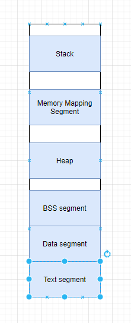

### Systems & Software
##### Lin Shi (n92s773)
##### linshi1768@gmail.com
##### CSCI 476
##### February 1, 2021
 

1. **fork() will create a copy of the calling process**. If A is running, then calls fork, we will copy everything of A. **exec() will execute**, it takes in the information of the program you want to execute.

2. 
- Stack contains the address and content. Stack uses stack frames, which includes the function arguments, the return address, previous frame pointer, and local variables.
- Memory mapping segment will contain the file mapping and anonymous mappings, which includes libraries.
- Heap is used for dynamic memory allocation. For example, malloc will store information in the heap.
- BSS segment will contain the uninitialized global data, which means we will create some space in the application to store the information. For example, if we just declare a variable without assigning its value.
- Data segment have the initialized global data. For example, if you define a variable to be something.
- Text segment includes the instructions. It contains portion of an object file or the corresponding section of the program's address space that contains the executable instructions.

3. Code will be the instructions in which the hardware executes and the data is the information that the program uses to carry out those instruction. Additionally, you would not want to change or write to your code; however, you do want to write values, which is the data. Therefore, there must be a distinction between the code and the data.

4. Some threats that seems obvious after learning about the memory are stack overflow and heap overflow, the two types of buffer overflow. Where either the stack or the heap is going into the space of Memory Mapping Segment.

5. Trust boundary is the boundary where program data or execution changes its level of trust. It is any distinct boundary within which a system trusts all sub-systems or data. A data trust boundary is a point where data comes from an untrusted source.

6. Within the stack frame, we will have **function arguments**, the variables that are passed into the function. Then we will have a **return address**, which basically tells the function where to return to. Followed by **previous frame pointer**, which is a reference to the past frame. Lastly, we will also store the **local variables**.

7. Running Probe and looking at its location in memory:
- main is located in **probe (the executable)** near 561690f0c000, since that address is executable.
- printf is located in the **libc-2.31.so** library near 7f32c2cdb6000 since that is executable. Conceptually, it is located in the **Memory Mapping Segment**.
- argv is located in the **stack**. Since argv is all the arguments passed into a program when running it, it will be the stored on the stack.
- environ is located in the **stack** as well.

8. First, the program will run a **preprocessor**, which includes #define, #include, and etc.. This will result in a .i file. Then, the **compiler** will translate the .i file to assembly code (.s). Next, it will invoke **assembler** to produce the machine code (.o files). However, there are still pierces of code that is not complete. For example, things from the c library. Therefore, we must run this through the **linker**. The linker will go in and read all the references and add the appropriate information. On the same note, there are some linker that will work dynamically since the issue could not be resolved statically. Finally, you will get the **executable file**. Usually, the intermediate files, such as .i and .s files are deleted without you even noticing.
