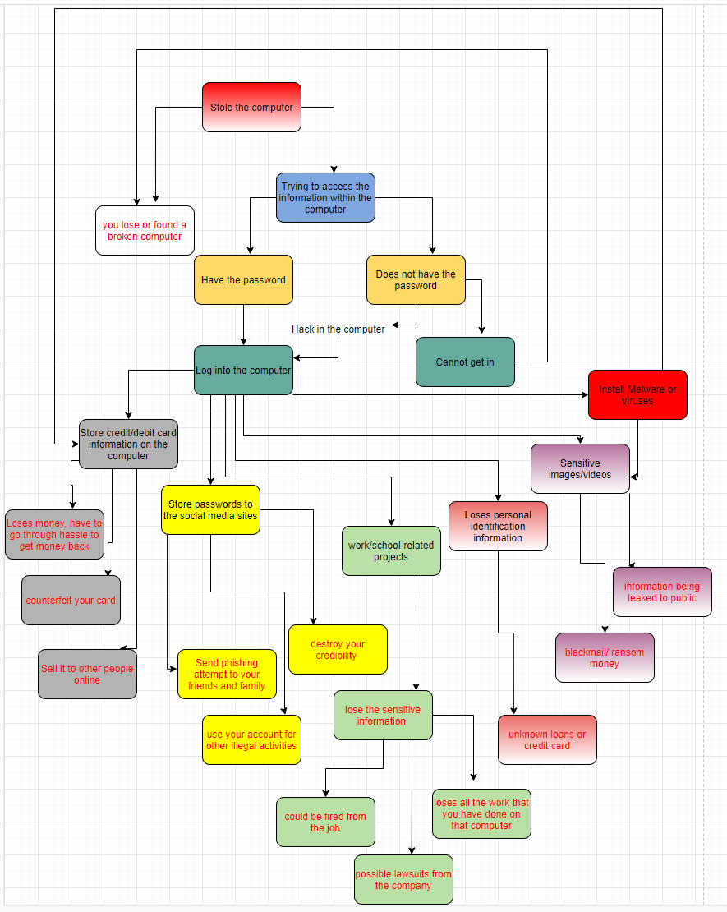

# CSCI 476 Computer Security
### Name: Lin Shi (n92s773)
### Course: CSCI 476
### Email: linshi1768@gmail.com

#### Threat Model
#### January 26, 2021

1.
 
I have gone with a scenario-based combined with asset-centric brainstorming exercise. I was thinking about the different scenarios in which the thieve could access the assets on the computer or computer itself while using an Attack-Tree-like chart to demonstrate my ideas.  
 
(Same information as the chart but with some explanations): 
 
Given that your laptop was stolen when you stepped away and the thieve is planning on doing some harm to you or your computer. Here is the Threat Model:  
If they are interested in the computer itself, you could have lost the computer. If they just wish to make your week depressing, you might find your computer broken (or maybe due to frustration when trying to get in?).  
If the person who has your computer is more interested in the information within the computer rather than the computer itself and they have your login information, they can simply log into your computer. If they do not have the information, they could be hacking into the computer, or it is going to be lost or broken.
Now, given the fact that they are logged in, there are many things they could do if you do not respond in a timely manner.  
*First, if you have stored your credit or debit card information on the computer, they could use the information to buy items for themselves, counterfeit your card for later use, or sell the information to other people online. All of the outcomes are extremely frustrating to deal with.
*Second, you need to log off the social media accounts remotely. Otherwise, they can use your social media ID. They could send phishing attempts to your friends and family, which could include asking for money or remotely hacking their computers. Although unlikely, the thieves could use it to destroy your credibility by sending unwanted images or dialogs to your friends. If you do not log off at all, they could use your social media ID for many other illegal activities.
*Third, if you do not store any password on your computer, there could still find some information that is not protected being useful for the thieves. For example, if you have work or school-related projects on your computer. You are going to lose the work that has been done on it. Additionally, if there are some sensitive company information, it could result in being fired from the job as well as lawsuits if the damage is huge.
*Additionally, if you have personal identification information stored on your computer. For example, Social Security Number. It could result in identity theft, which could lead to unknown loads, new credit lines.
Next, if there exist some unwanted images or videos on your computer or some cloud service which you are logged onto, the thieves could use this against you, asking for ransom, blackmail, or leaking the information to the public.
*Lastly, if the thieves did not get the information they want right away and they are extremely fast at completing the hack, they could install malware or viruses into your computer. If you do not notice (or you might have had a very deep conversation and took off for hours) and continue to use your computer as normal, all of the above scenarios could occur.

2.The strength of the approach is the discussion of all the different possible information on the computer. Since not everyone stores the same information or is worried about the same information on the computer, discussing all the different scenarios or assets, will apply more to the general public. Everyone could focus on the assets they value or is a problem protecting.

3.The weakness of the approach is obvious as well. I tried to find all the scenarios by myself. There could be some assets that I do not consider to be valuable that are worth something for others. Additionally, I might not know all the possible attacks against a login system, which is why I did not discuss possible ways to protect some unwanted users from logging in.

4.
In the future, I would apply this idea to a group of people with a different background. We will all have different views which will help fulfill some of the missing ideas that I have. Additionally, I would dig deeper into how they could attack the computer which could also help how we should protect unwanted users from logging in, not just discuss each asset that we could think of.
